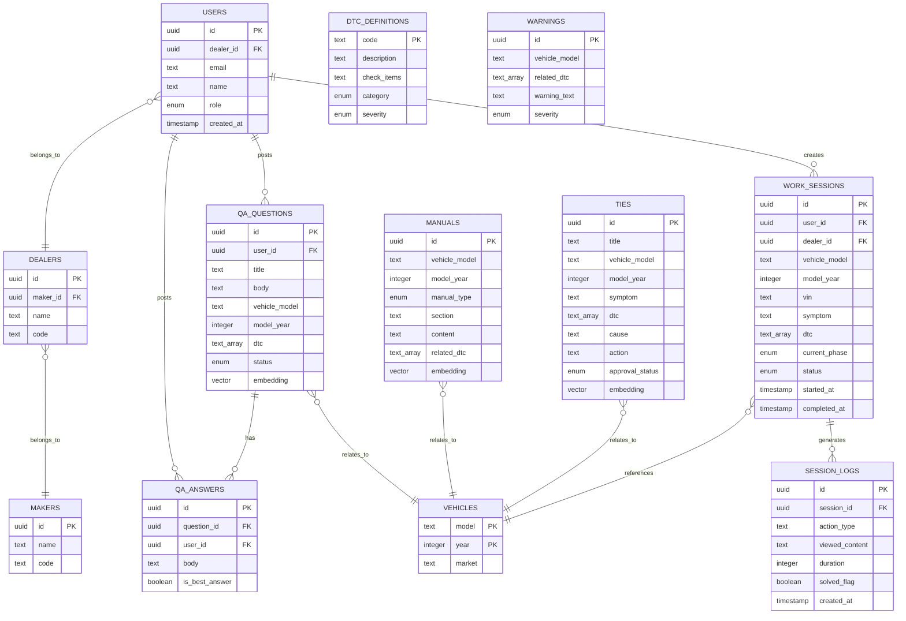

# データベース設計書

**プロジェクト**: e-library Next  
**バージョン**: 1.1  
**作成日**: 2026年6月17日  
**最終更新日**: 2026年6月17日  

---

## 目次

1. [概要](#1-概要)
2. [データベース選定](#2-データベース選定)
3. [ER図](#3-er図)
4. [テーブル定義](#4-テーブル定義)
5. [インデックス戦略](#5-インデックス戦略)
6. [セキュリティとアクセス制御](#6-セキュリティとアクセス制御)
7. [データ移行計画](#7-データ移行計画)
8. [バックアップとリカバリ](#8-バックアップとリカバリ)

---

## 1. 概要

e-library Nextは、自動車整備士向けの作業フロー駆動型情報提示システムです。本ドキュメントでは、システムで使用するデータベースの構造、テーブル定義、インデックス戦略、およびセキュリティ設計を定義します。

### 1.1 データベースの役割

- **作業セッション管理**: 整備士の作業履歴、進捗状況を記録
- **技術情報管理**: マニュアル、TIE（修理事例）、問題交流（Q&A）の保管
- **推薦エンジン**: 作業コンテキストに基づく情報推薦のためのデータ提供
- **ユーザー管理**: 整備士、ディーラー、メーカーの情報管理
- **ログ記録**: ユーザー行動、フィードバック、分析データの蓄積

---

## 2. データベース選定

### 2.1 選定技術: Neon (PostgreSQL)

**理由:**
- **サーバーレス**: インフラ管理不要、自動スケーリング
- **PostgreSQL互換**: リレーショナルDBの強力な機能（外部キー、トランザクション、ACID保証）
- **pgvector対応**: ベクトル検索（意味的類似検索）が可能
- **全文検索**: PostgreSQLの全文検索機能（tsvector, tsquery）
- **Row Level Security**: Supabaseとの統合により、ユーザー単位のアクセス制御が容易

### 2.2 データ型の特徴

| PostgreSQL データ型 | 用途 |
|---|---|
| UUID | 主キー（ランダムでグローバルにユニーク） |
| TEXT | 文字列（可変長、制限なし） |
| INTEGER | 整数（年式、数値ID） |
| TIMESTAMP | 日時（タイムゾーン付き） |
| TEXT[] | 配列（DTC、タグなど） |
| ENUM | 列挙型（ステータス、工程、重要度など） |
| vector | ベクトル型（pgvector拡張、OpenAI Embeddings） |
| BOOLEAN | 真偽値 |

---

## 3. ER図

### 3.1 エンティティ関係図



### 3.2 リレーション概要

| リレーション | 多重度 | 説明 |
|---|---|---|
| USERS ↔ DEALERS | N:1 | ユーザーは1つのディーラーに所属 |
| DEALERS ↔ MAKERS | N:1 | ディーラーは1つのメーカーに所属 |
| USERS ↔ WORK_SESSIONS | 1:N | ユーザーは複数の作業セッションを作成 |
| WORK_SESSIONS ↔ SESSION_LOGS | 1:N | 作業セッションは複数のログを生成 |
| USERS ↔ QA_QUESTIONS | 1:N | ユーザーは複数の質問を投稿 |
| USERS ↔ QA_ANSWERS | 1:N | ユーザーは複数の回答を投稿 |
| QA_QUESTIONS ↔ QA_ANSWERS | 1:N | 質問は複数の回答を持つ |

---

## 4. テーブル定義

### 4.1 ユーザー管理テーブル

#### 4.1.1 users テーブル

**概要**: システムを利用する整備士・管理者の情報を管理

| カラム名 | データ型 | 制約 | 説明 |
|---|---|---|---|
| id | UUID | PK | ユーザーID（Supabase AuthのUUIDと一致） |
| dealer_id | UUID | FK, NOT NULL | ディーラーID |
| email | TEXT | UNIQUE, NOT NULL | メールアドレス |
| name | TEXT | NOT NULL | 氏名 |
| role | ENUM | NOT NULL | ロール（technician, manager, admin） |
| created_at | TIMESTAMP | NOT NULL, DEFAULT NOW() | 作成日時 |
| updated_at | TIMESTAMP | NOT NULL, DEFAULT NOW() | 更新日時 |

**ENUM定義:**
```sql
CREATE TYPE user_role AS ENUM ('technician', 'manager', 'admin');
```

**インデックス:**
- `idx_users_dealer_id (dealer_id)` - ディーラー別ユーザー検索
- `idx_users_email (email)` - メールアドレス検索

#### 4.1.2 dealers テーブル

**概要**: ディーラー（販売店）の情報を管理

| カラム名 | データ型 | 制約 | 説明 |
|---|---|---|---|
| id | UUID | PK | ディーラーID |
| maker_id | UUID | FK, NOT NULL | メーカーID |
| name | TEXT | NOT NULL | ディーラー名 |
| code | TEXT | UNIQUE, NOT NULL | ディーラーコード（例: A001） |
| created_at | TIMESTAMP | NOT NULL, DEFAULT NOW() | 作成日時 |
| updated_at | TIMESTAMP | NOT NULL, DEFAULT NOW() | 更新日時 |

**インデックス:**
- `idx_dealers_maker_id (maker_id)` - メーカー別ディーラー検索
- `idx_dealers_code (code)` - コード検索

#### 4.1.3 makers テーブル

**概要**: 自動車メーカーの情報を管理

| カラム名 | データ型 | 制約 | 説明 |
|---|---|---|---|
| id | UUID | PK | メーカーID |
| name | TEXT | NOT NULL | メーカー名 |
| code | TEXT | UNIQUE, NOT NULL | メーカーコード（例: TOYOTA） |
| created_at | TIMESTAMP | NOT NULL, DEFAULT NOW() | 作成日時 |
| updated_at | TIMESTAMP | NOT NULL, DEFAULT NOW() | 更新日時 |

**インデックス:**
- `idx_makers_code (code)` - コード検索

---

### 4.2 作業管理テーブル

#### 4.2.1 work_sessions テーブル

**概要**: 整備士の作業セッション（作業開始〜完了までの一連の流れ）を管理

| カラム名 | データ型 | 制約 | 説明 |
|---|---|---|---|
| id | UUID | PK | 作業セッションID |
| user_id | UUID | FK, NOT NULL | 整備士ID |
| dealer_id | UUID | FK, NOT NULL | ディーラーID |
| vehicle_model | TEXT | NOT NULL | 車種（例: Model A） |
| model_year | INTEGER | NOT NULL | 年式（例: 2024） |
| vin | TEXT | NULL | VIN（17桁、任意） |
| symptom | TEXT | NULL | 症状（任意） |
| dtc | TEXT[] | NULL | DTCコード配列（例: ['P0420', 'P0300']） |
| current_phase | ENUM | NOT NULL, DEFAULT 'intake' | 現在の作業工程 |
| status | ENUM | NOT NULL, DEFAULT 'in_progress' | ステータス |
| started_at | TIMESTAMP | NOT NULL | 作業開始時刻 |
| completed_at | TIMESTAMP | NULL | 作業完了時刻 |
| created_at | TIMESTAMP | NOT NULL, DEFAULT NOW() | 作成日時 |
| updated_at | TIMESTAMP | NOT NULL, DEFAULT NOW() | 更新日時 |

**ENUM定義:**
```sql
CREATE TYPE work_phase AS ENUM ('intake', 'diagnosis', 'planning', 'execution', 'verification', 'delivery');
CREATE TYPE work_status AS ENUM ('in_progress', 'paused', 'completed');
```

**インデックス:**
- `idx_work_sessions_user_id (user_id)` - ユーザー別セッション検索
- `idx_work_sessions_dealer_id (dealer_id)` - ディーラー別セッション検索
- `idx_work_sessions_status (status)` - ステータス別セッション検索
- `idx_work_sessions_vehicle (vehicle_model, model_year)` - 車種別セッション検索
- `idx_work_sessions_dtc (dtc) USING GIN` - DTC配列検索

#### 4.2.2 session_logs テーブル

**概要**: 作業セッション内のユーザー行動ログを記録

| カラム名 | データ型 | 制約 | 説明 |
|---|---|---|---|
| id | UUID | PK | ログID |
| session_id | UUID | FK, NOT NULL | 作業セッションID |
| action_type | TEXT | NOT NULL | アクション種別（view_manual, view_tie, search, feedback） |
| viewed_content | TEXT | NULL | 閲覧したコンテンツID（例: manual-123） |
| duration | INTEGER | NULL | 閲覧時間（秒） |
| solved_flag | BOOLEAN | NULL | 問題解決フラグ |
| created_at | TIMESTAMP | NOT NULL, DEFAULT NOW() | 作成日時 |

**インデックス:**
- `idx_session_logs_session_id (session_id)` - セッション別ログ検索
- `idx_session_logs_action_type (action_type)` - アクション種別検索

---

### 4.3 技術情報テーブル

#### 4.3.1 vehicles テーブル

**概要**: 車両マスタ（車種・年式の組み合わせ）

| カラム名 | データ型 | 制約 | 説明 |
|---|---|---|---|
| model | TEXT | PK | 車種（例: Model A） |
| year | INTEGER | PK | 年式（例: 2024） |
| market | TEXT | NOT NULL | 市場（例: JP, US, EU） |
| created_at | TIMESTAMP | NOT NULL, DEFAULT NOW() | 作成日時 |
| updated_at | TIMESTAMP | NOT NULL, DEFAULT NOW() | 更新日時 |

**複合主キー**: (model, year)

**インデックス:**
- `idx_vehicles_market (market)` - 市場別検索

#### 4.3.2 manuals テーブル

**概要**: 車両マニュアル（サービスマニュアル、取扱説明書など）

| カラム名 | データ型 | 制約 | 説明 |
|---|---|---|---|
| id | UUID | PK | マニュアルID |
| vehicle_model | TEXT | NOT NULL | 車種 |
| model_year | INTEGER | NOT NULL | 年式 |
| manual_type | ENUM | NOT NULL | マニュアル種別 |
| section | TEXT | NOT NULL | セクション（例: Engine / Electrical） |
| content | TEXT | NOT NULL | マニュアル本文 |
| pdf_url | TEXT | NULL | PDFファイルのURL（Supabase Storage） |
| related_dtc | TEXT[] | NULL | 関連DTCコード配列 |
| embedding | vector(1536) | NULL | OpenAI Embeddingsのベクトル |
| created_at | TIMESTAMP | NOT NULL, DEFAULT NOW() | 作成日時 |
| updated_at | TIMESTAMP | NOT NULL, DEFAULT NOW() | 更新日時 |

**ENUM定義:**
```sql
CREATE TYPE manual_type AS ENUM ('service_manual', 'user_manual', 'repair_guide');
```

**インデックス:**
- `idx_manuals_vehicle (vehicle_model, model_year)` - 車種別マニュアル検索
- `idx_manuals_manual_type (manual_type)` - マニュアル種別検索
- `idx_manuals_related_dtc (related_dtc) USING GIN` - DTC配列検索
- `idx_manuals_embedding (embedding) USING ivfflat` - ベクトル検索（pgvector）

#### 4.3.3 ties テーブル

**概要**: TIE（Technical Information Exchange: 修理事例レポート）

| カラム名 | データ型 | 制約 | 説明 |
|---|---|---|---|
| id | UUID | PK | TIE ID |
| title | TEXT | NOT NULL | タイトル |
| vehicle_model | TEXT | NOT NULL | 車種 |
| model_year | INTEGER | NOT NULL | 年式 |
| symptom | TEXT | NOT NULL | 症状 |
| dtc | TEXT[] | NULL | DTCコード配列 |
| cause | TEXT | NOT NULL | 原因 |
| action | TEXT | NOT NULL | 対処法 |
| approval_status | ENUM | NOT NULL, DEFAULT 'draft' | 承認ステータス |
| embedding | vector(1536) | NULL | OpenAI Embeddingsのベクトル |
| created_at | TIMESTAMP | NOT NULL, DEFAULT NOW() | 作成日時 |
| updated_at | TIMESTAMP | NOT NULL, DEFAULT NOW() | 更新日時 |
| approved_at | TIMESTAMP | NULL | 承認日時 |
| approved_by | UUID | FK, NULL | 承認者ID |

**ENUM定義:**
```sql
CREATE TYPE tie_approval_status AS ENUM ('draft', 'pending', 'approved', 'rejected');
```

**インデックス:**
- `idx_ties_vehicle (vehicle_model, model_year)` - 車種別TIE検索
- `idx_ties_dtc (dtc) USING GIN` - DTC配列検索
- `idx_ties_approval_status (approval_status)` - 承認ステータス検索
- `idx_ties_embedding (embedding) USING ivfflat` - ベクトル検索（pgvector）

#### 4.3.4 qa_questions テーブル

**概要**: 問題交流（Q&A）の質問

| カラム名 | データ型 | 制約 | 説明 |
|---|---|---|---|
| id | UUID | PK | 質問ID |
| user_id | UUID | FK, NOT NULL | 質問者ID |
| title | TEXT | NOT NULL | タイトル |
| body | TEXT | NOT NULL | 質問本文 |
| vehicle_model | TEXT | NULL | 車種（任意） |
| model_year | INTEGER | NULL | 年式（任意） |
| dtc | TEXT[] | NULL | DTCコード配列（任意） |
| status | ENUM | NOT NULL, DEFAULT 'open' | ステータス |
| embedding | vector(1536) | NULL | OpenAI Embeddingsのベクトル |
| created_at | TIMESTAMP | NOT NULL, DEFAULT NOW() | 作成日時 |
| updated_at | TIMESTAMP | NOT NULL, DEFAULT NOW() | 更新日時 |

**ENUM定義:**
```sql
CREATE TYPE qa_status AS ENUM ('open', 'resolved', 'closed');
```

**インデックス:**
- `idx_qa_questions_user_id (user_id)` - ユーザー別質問検索
- `idx_qa_questions_vehicle (vehicle_model)` - 車種別質問検索
- `idx_qa_questions_dtc (dtc) USING GIN` - DTC配列検索
- `idx_qa_questions_status (status)` - ステータス検索
- `idx_qa_questions_embedding (embedding) USING ivfflat` - ベクトル検索（pgvector）

#### 4.3.5 qa_answers テーブル

**概要**: 問題交流（Q&A）の回答

| カラム名 | データ型 | 制約 | 説明 |
|---|---|---|---|
| id | UUID | PK | 回答ID |
| question_id | UUID | FK, NOT NULL | 質問ID |
| user_id | UUID | FK, NOT NULL | 回答者ID |
| body | TEXT | NOT NULL | 回答本文 |
| is_best_answer | BOOLEAN | NOT NULL, DEFAULT FALSE | ベストアンサーフラグ |
| created_at | TIMESTAMP | NOT NULL, DEFAULT NOW() | 作成日時 |
| updated_at | TIMESTAMP | NOT NULL, DEFAULT NOW() | 更新日時 |

**インデックス:**
- `idx_qa_answers_question_id (question_id)` - 質問別回答検索
- `idx_qa_answers_user_id (user_id)` - ユーザー別回答検索

---

### 4.4 マスタデータテーブル

#### 4.4.1 dtc_definitions テーブル

**概要**: DTC（Diagnostic Trouble Code）定義マスタ

| カラム名 | データ型 | 制約 | 説明 |
|---|---|---|---|
| code | TEXT | PK | DTCコード（例: P0420） |
| description | TEXT | NOT NULL | DTC説明（例: 触媒効率低下） |
| check_items | TEXT | NOT NULL | 確認すべき項目（改行区切り） |
| category | ENUM | NOT NULL | カテゴリ |
| severity | ENUM | NOT NULL | 重要度 |
| created_at | TIMESTAMP | NOT NULL, DEFAULT NOW() | 作成日時 |
| updated_at | TIMESTAMP | NOT NULL, DEFAULT NOW() | 更新日時 |

**ENUM定義:**
```sql
CREATE TYPE dtc_category AS ENUM ('engine', 'transmission', 'electrical', 'brake', 'suspension', 'other');
CREATE TYPE severity_level AS ENUM ('high', 'medium', 'low');
```

**インデックス:**
- `idx_dtc_definitions_category (category)` - カテゴリ別検索
- `idx_dtc_definitions_severity (severity)` - 重要度別検索

**サンプルデータ:**
```sql
INSERT INTO dtc_definitions (code, description, check_items, category, severity) VALUES
('P0420', '触媒効率低下', '1. O2センサーの配線接続\n2. センサーの動作確認\n3. ECUとの通信状態', 'engine', 'medium'),
('P0300', 'ランダム失火検出', '1. スパークプラグの状態確認\n2. イグニッションコイルの動作確認\n3. 燃料噴射の異常確認', 'engine', 'high');
```

#### 4.4.2 warnings テーブル

**概要**: 注意事項マスタ

| カラム名 | データ型 | 制約 | 説明 |
|---|---|---|---|
| id | UUID | PK | 注意事項ID |
| vehicle_model | TEXT | NULL | 対象車種（NULLの場合は全車種） |
| related_dtc | TEXT[] | NOT NULL | 関連DTCコード配列 |
| warning_text | TEXT | NOT NULL | 注意事項本文 |
| severity | ENUM | NOT NULL | 重要度 |
| created_at | TIMESTAMP | NOT NULL, DEFAULT NOW() | 作成日時 |
| updated_at | TIMESTAMP | NOT NULL, DEFAULT NOW() | 更新日時 |

**ENUM定義:**
```sql
-- severity_level は dtc_definitions と共通
```

**インデックス:**
- `idx_warnings_vehicle_model (vehicle_model)` - 車種別検索
- `idx_warnings_related_dtc (related_dtc) USING GIN` - DTC配列検索
- `idx_warnings_severity (severity)` - 重要度別検索

**サンプルデータ:**
```sql
INSERT INTO warnings (vehicle_model, related_dtc, warning_text, severity) VALUES
('Model A', ARRAY['P0420', 'P0430'], '⚠️ 作業前に必ずイグニッションOFFを確認してください', 'high'),
(NULL, ARRAY['P0300', 'P0301', 'P0302'], '⚠️ O2センサー交換時はトルク値 55Nmを厳守してください', 'high');
```

---

## 5. インデックス戦略

### 5.1 インデックス設計の原則

- **頻繁に検索されるカラム**: WHERE句で使用されるカラムにインデックスを作成
- **外部キー**: JOIN時のパフォーマンス向上のため、外部キーにインデックスを作成
- **配列カラム**: GINインデックスを使用（TEXT[]型のカラム）
- **ベクトルカラム**: IVFFlat / HNSWインデックスを使用（pgvector）
- **複合インデックス**: 複数カラムの組み合わせで検索する場合に使用

### 5.2 インデックス一覧（重要なもの）

| テーブル | インデックス名 | カラム | 種類 | 目的 |
|---|---|---|---|---|
| work_sessions | idx_work_sessions_user_id | user_id | B-tree | ユーザー別セッション検索 |
| work_sessions | idx_work_sessions_vehicle | (vehicle_model, model_year) | B-tree | 車種別セッション検索 |
| work_sessions | idx_work_sessions_dtc | dtc | GIN | DTC配列検索 |
| manuals | idx_manuals_vehicle | (vehicle_model, model_year) | B-tree | 車種別マニュアル検索 |
| manuals | idx_manuals_related_dtc | related_dtc | GIN | DTC配列検索 |
| manuals | idx_manuals_embedding | embedding | IVFFlat | ベクトル検索 |
| ties | idx_ties_vehicle | (vehicle_model, model_year) | B-tree | 車種別TIE検索 |
| ties | idx_ties_dtc | dtc | GIN | DTC配列検索 |
| ties | idx_ties_embedding | embedding | IVFFlat | ベクトル検索 |
| qa_questions | idx_qa_questions_dtc | dtc | GIN | DTC配列検索 |
| qa_questions | idx_qa_questions_embedding | embedding | IVFFlat | ベクトル検索 |

### 5.3 ベクトル検索のインデックス

pgvectorでは、以下のインデックスタイプが利用可能：

**IVFFlat（Inverted File with Flat compression）**
```sql
CREATE INDEX idx_manuals_embedding ON manuals USING ivfflat (embedding vector_cosine_ops)
WITH (lists = 100);
```

**HNSW（Hierarchical Navigable Small World）**（pgvector 0.5.0以降）
```sql
CREATE INDEX idx_manuals_embedding ON manuals USING hnsw (embedding vector_cosine_ops);
```

**推奨**: 初期はIVFFlatを使用し、データ量が増加したらHNSWに切り替え

---

## 6. セキュリティとアクセス制御

### 6.1 Row Level Security（RLS）

Supabase + Neonの組み合わせにより、テーブル単位でRow Level Securityを設定可能。

#### 6.1.1 work_sessions テーブルのRLS

**ポリシー**: ユーザーは自分のディーラーの作業セッションのみ閲覧可能

```sql
ALTER TABLE work_sessions ENABLE ROW LEVEL SECURITY;

CREATE POLICY "Users can only see their own dealer's work sessions"
ON work_sessions
FOR SELECT
USING (dealer_id = (SELECT dealer_id FROM users WHERE id = auth.uid()));
```

#### 6.1.2 manuals テーブルのRLS

**ポリシー**: ユーザーは自分のメーカーのマニュアルのみ閲覧可能

```sql
ALTER TABLE manuals ENABLE ROW LEVEL SECURITY;

CREATE POLICY "Users can only see their own maker's manuals"
ON manuals
FOR SELECT
USING (maker_id IN (
  SELECT m.id FROM makers m
  JOIN dealers d ON d.maker_id = m.id
  JOIN users u ON u.dealer_id = d.id
  WHERE u.id = auth.uid()
));
```

**注意**: `manuals` テーブルに `maker_id` カラムを追加するか、`vehicles` テーブル経由でメーカーを特定する必要がある。

### 6.2 暗号化

- **通信暗号化**: HTTPS（TLS 1.2以上）
- **データベース暗号化**: Neonのデフォルト設定で暗号化済み
- **パスワード**: Supabase Authで自動的にハッシュ化（bcrypt）

### 6.3 監査ログ

- `session_logs` テーブル: ユーザー行動ログを1年間保持
- `created_at`, `updated_at` カラム: 全テーブルに作成日時・更新日時を記録

---

## 7. データ移行計画

### 7.1 既存データの移行

**Phase 1: データ構造確認**
- 既存のマニュアル、TIE、問題交流のデータ形式を確認（PDF、Word、Excelなど）
- データ移行の工数見積もり

**Phase 2: データ抽出**
- PDFからテキスト抽出（OCR）
- Wordファイルからテキスト抽出
- Excelファイルから構造化データ抽出

**Phase 3: タグ付け**
- 車種、年式、DTC、症状のタグ付け
- 自動タグ付け（AI）と人手の併用

**Phase 4: DB投入**
- 抽出・タグ付けしたデータをNeon DBに投入
- バリデーション、重複チェック

**Phase 5: ベクトル化**
- OpenAI Embeddingsで各データをベクトル化
- `embedding` カラムに格納

### 7.2 データ移行スクリプト例

```sql
-- マニュアルデータの一括投入
INSERT INTO manuals (vehicle_model, model_year, manual_type, section, content, related_dtc)
SELECT 
  vehicle_model,
  model_year,
  'service_manual',
  section,
  content,
  string_to_array(dtc_codes, ',')  -- カンマ区切りを配列に変換
FROM staging_manuals;

-- ベクトル化（別途Node.jsスクリプトで実施）
UPDATE manuals
SET embedding = get_openai_embedding(content)  -- カスタム関数
WHERE embedding IS NULL;
```

---

## 8. バックアップとリカバリ

### 8.1 バックアップ戦略

**Neonの自動バックアップ**
- 毎日自動バックアップ（7日間保持）
- Point-in-Time Recovery（PITR）対応

**手動バックアップ**
- 重要なマイルストーン（Phase完了時）に手動バックアップを実施
- `pg_dump` でデータベース全体をエクスポート

### 8.2 リカバリ手順

**データベース全体の復元**
```bash
# バックアップ
pg_dump $DATABASE_URL > backup.sql

# 復元
psql $DATABASE_URL < backup.sql
```

**特定テーブルの復元**
```bash
# バックアップ
pg_dump $DATABASE_URL -t work_sessions > work_sessions_backup.sql

# 復元
psql $DATABASE_URL < work_sessions_backup.sql
```

**Point-in-Time Recovery**
- Neonの管理画面から、特定の時点にデータベースを復元可能

### 8.3 RPO / RTO

- **RPO（Recovery Point Objective）**: 24時間以内
- **RTO（Recovery Time Objective）**: 4時間以内

---

## 付録

### A. データベース初期化SQL

```sql
-- データベース作成（Neonで自動作成済み）
-- CREATE DATABASE elibrary_next;

-- 拡張機能のインストール
CREATE EXTENSION IF NOT EXISTS "uuid-ossp";  -- UUID生成
CREATE EXTENSION IF NOT EXISTS "pgvector";   -- ベクトル検索

-- ENUM型の作成
CREATE TYPE user_role AS ENUM ('technician', 'manager', 'admin');
CREATE TYPE work_phase AS ENUM ('intake', 'diagnosis', 'planning', 'execution', 'verification', 'delivery');
CREATE TYPE work_status AS ENUM ('in_progress', 'paused', 'completed');
CREATE TYPE manual_type AS ENUM ('service_manual', 'user_manual', 'repair_guide');
CREATE TYPE tie_approval_status AS ENUM ('draft', 'pending', 'approved', 'rejected');
CREATE TYPE qa_status AS ENUM ('open', 'resolved', 'closed');
CREATE TYPE dtc_category AS ENUM ('engine', 'transmission', 'electrical', 'brake', 'suspension', 'other');
CREATE TYPE severity_level AS ENUM ('high', 'medium', 'low');

-- テーブル作成（省略、上記の定義を参照）
```

### B. パフォーマンスチューニング

**接続プール設定**
- Neonのデフォルト設定で十分（自動管理）

**クエリ最適化**
- `EXPLAIN ANALYZE` でクエリプランを確認
- インデックスの効果を測定

**統計情報の更新**
```sql
ANALYZE;  -- 全テーブルの統計情報を更新
VACUUM ANALYZE;  -- ガベージコレクション + 統計情報更新
```

---

**以上、データベース設計書v1.1**
