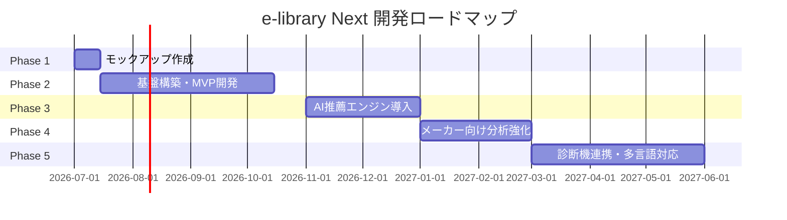
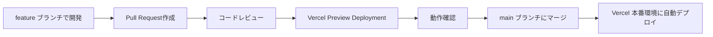

# 開発計画書

**プロジェクト**: e-library Next  
**バージョン**: 1.1  
**作成日**: 2026年6月17日  
**最終更新日**: 2026年6月17日  

---

## 目次

1. [概要](#1-概要)
2. [開発ロードマップ](#2-開発ロードマップ)
3. [MVP定義](#3-mvp定義)
4. [PoC計画](#4-poc計画)
5. [タスク分解（WBS）](#5-タスク分解wbs)
6. [リスク管理](#6-リスク管理)
7. [品質保証計画](#7-品質保証計画)
8. [デプロイ計画](#8-デプロイ計画)
9. [運用体制](#9-運用体制)

---

## 1. 概要

e-library Nextは、自動車整備士向けの作業フロー駆動型情報提示システムです。本ドキュメントでは、開発の進め方、タスク分解、リスク管理、および運用方針を定義します。

### 1.1 プロジェクト制約

- **予算**: 既存サービスの収益が月額約2,000円のため、初期開発コストは限定的
- **期間**: Phase 1（モックアップ）は1-2週間、Phase 2（基盤構築）は3-4ヶ月
- **既存データ**: 既存マニュアル、TIE、問題交流のデータ構造化とタグ付けに時間がかかる可能性
- **技術スタック**: Next.js、TypeScript、Supabase、Neon、Vercelを前提
- **チームスキル**: （仮定）フロントエンド・バックエンド開発の基本スキルは保有、AI/機械学習は学習が必要

---

## 2. 開発ロードマップ

### 2.1 全体ロードマップ

e-library Nextの開発は、5つのフェーズに分けて段階的に進めます。

---

### 2.2 Phase 1: モックアップ作成（1〜2週間）

#### 目的
- 顧客（メーカー、ディーラー）に対して、新しいコンセプト（作業フロー駆動の情報提示）を視覚的に提示
- フィードバックを収集し、Phase 2の要件を確定

#### 主要成果物
- Figma / Adobe XDでの画面デザイン
- 作業セッション画面、工程別自動情報提示のモックアップ
- ユーザーフロー図、画面遷移図

#### タスク
1. **ワイヤーフレーム作成**（3日）
   - トップ画面、作業セッション画面、AI検索画面
2. **高精度モックアップ作成**（5日）
   - デザインシステム適用、カラーパレット、タイポグラフィ
3. **顧客プレゼンテーション**（2日）
   - モックアップを使ったデモ、フィードバック収集

#### 成功基準
- 顧客から「この方向性で進めてほしい」という合意を得る
- フィードバックに基づく要件の修正・追加

---

### 2.3 Phase 2: 基盤構築・MVP開発（3〜4ヶ月）

#### 目的
- MVPを完成させ、限定的なユーザー（1〜2ディーラー、5〜10名の整備士）でPoC（実証実験）を実施
- ルールベースの工程別自動情報提示を実装し、探索時間削減効果を検証

#### 主要成果物
- Next.js + Supabase + Neonで構築したWebアプリケーション
- 作業セッション管理、工程別自動情報提示、マニュアル閲覧、TIE閲覧、問題交流、AI検索（フォールバック）
- 既存データの構造化・タグ付け・投入

#### タスク
詳細は [5. タスク分解（WBS）](#5-タスク分解wbs) を参照

#### 成功基準
- **探索時間削減率**: 50%以上（10-20分 → 5-10分）
- **自動提示情報活用率**: 50%以上
- **ユーザーフィードバック**: 「自動提示情報が役立った」が60%以上

---

### 2.4 Phase 3: AI推薦エンジン導入（2ヶ月）

#### 目的
- ルールベースの推薦エンジンをAI/機械学習ベースに切り替え、推薦精度を向上
- 探索時間削減率を70%以上（Phase 2の50%から改善）

#### 主要成果物
- OpenAI APIを活用した動的AI要約生成
- ベクトル検索（pgvector）による意味的類似検索
- 推薦エンジンの精度評価ダッシュボード

#### タスク
1. **OpenAI Embeddings によるベクトル化**（2週間）
   - マニュアル、TIE、問題交流のベクトル化
   - pgvectorインデックスの作成
2. **AI要約生成**（2週間）
   - DTC定義 + マニュアル + TIE事例を基にした動的要約生成
   - プロンプトエンジニアリング、精度評価
3. **推薦ロジックの改善**（3週間）
   - ベクトル検索スコア + ルールベーススコアのハイブリッド推薦
   - ユーザーフィードバックを活用した学習ループ
4. **精度評価とチューニング**（1週間）
   - A/Bテスト、精度評価、ハイパーパラメータ調整

#### 成功基準
- **探索時間削減率**: 70%以上（10-20分 → 3-6分）
- **自動提示情報活用率**: 70%以上
- **AI要約の満足度**: 70%以上

---

### 2.5 Phase 4: メーカー向け分析強化（2ヶ月）

#### 目的
- メーカー管理者向けの分析ダッシュボードを拡充し、販売店支援、品質改善、教育施策に活用できるデータを提供

#### 主要成果物
- 分析ダッシュボード（Looker Studio / Metabase）
- 月次レポート自動生成機能
- 未解決課題、頻出症状の自動検出・アラート

#### タスク
1. **データ分析基盤構築**（3週間）
   - session_logs テーブルからのデータ抽出、集計
   - BigQuery / Neon Analytics との連携
2. **ダッシュボード開発**（3週間）
   - 車種別・症状別の作業セッション数、閲覧数、質問数の可視化
   - 自動提示情報の活用率、フォールバック（検索）利用率の可視化
3. **月次レポート自動生成**（2週間）
   - PDF / Excel形式でのレポート生成
   - 頻出症状、未解決課題、推薦精度の月次推移

#### 成功基準
- **メーカー管理者の利用率**: 80%以上（週次でダッシュボードを確認）
- **頻出課題抽出数**: 月10テーマ以上
- **TIE化件数**: 月5件以上（未解決課題 → TIE化）

---

### 2.6 Phase 5: 診断機連携・多言語対応（3ヶ月）

#### 目的
- 診断機（OBDスキャナー）、整備受付システムとのAPI連携により、手動入力の負担を削減
- 多言語対応により、海外拠点への展開を可能にする

#### 主要成果物
- 診断機API連携（DTC自動取得）
- 整備受付システムAPI連携（入庫情報自動取得）
- 多言語対応（英語、中国語、タイ語）

#### タスク
1. **診断機API連携**（4週間）
   - 診断機ベンダーのAPI仕様調査、連携設計
   - DTC自動取得、作業セッション自動開始
2. **整備受付システムAPI連携**（4週間）
   - 整備受付システムのAPI仕様調査、連携設計
   - 入庫情報自動取得、車両情報自動入力
3. **多言語対応**（4週間）
   - i18nライブラリの導入（next-i18next）
   - 英語、中国語、タイ語の翻訳、UI調整

#### 成功基準
- **DTC自動取得成功率**: 90%以上
- **入庫情報自動取得成功率**: 80%以上
- **多言語対応言語数**: 3言語以上

---

## 3. MVP定義

Phase 2完了時点でのMVP（Minimum Viable Product）を以下のように定義します。

### 3.1 MVP機能範囲

1. **作業セッション管理**
   - 作業開始、車両情報入力、作業工程管理、作業完了
   
2. **ルールベースの工程別自動情報提示**
   - 作業工程 × 車両情報 × DTC × 症状に基づく情報抽出（Phase 2: ルールベース）
   
3. **マニュアル閲覧**
   - 車種・年式別のマニュアル一覧、PDF表示
   
4. **TIE閲覧**
   - 車種・年式・症状別のTIE一覧、TIE詳細表示
   
5. **問題交流（基本機能）**
   - 質問投稿、回答投稿、一覧表示
   
6. **AI検索（フォールバック）**
   - 自然言語検索、現在の作業コンテキストを引き継ぎ
   
7. **認証・権限管理**
   - メール認証、メーカー別・ディーラー別データ分離

### 3.2 MVP成功基準

- **探索時間削減率**: 50%以上（Phase 3のAI推薦エンジン導入で70%を目指す）
- **自動提示情報活用率**: 50%以上
- **ユーザーフィードバック**: 「自動提示情報が役立った」が60%以上

---

## 4. PoC計画

### 4.1 PoC目的

「作業フロー駆動の自動情報提示により、探す時間を50%以上削減できるか」を検証

### 4.2 PoC期間

- **準備期間**: 2週間（データ構造化、タグ付け、テストデータ投入）
- **実施期間**: 1ヶ月（実際の作業で使用）
- **分析期間**: 1週間（ログ分析、ヒアリング、改善提案）

**合計期間**: 約6週間

### 4.3 対象ユーザー

- **Aディーラー サービスショップ**: 整備士5名（経験3年以下2名、経験5年以上3名）
- **B自動車メーカー サービス部門**: 品質管理担当1名

### 4.4 検証シナリオ

#### シナリオ1: DTC診断時の自動情報提示

**手順**:
1. 整備士がDTC（P0420など）を入力
2. 診断手順、類似TIE事例、注意事項が自動表示される

**検証KPI**:
- 探索時間（目標: 10分 → 5分）
- 自動提示情報の活用率（目標: 50%以上）

#### シナリオ2: 作業工程に応じた情報変化

**手順**:
1. 診断 → 作業計画 → 作業実施と工程を進める
2. 各工程で異なる情報が自動表示される

**検証KPI**:
- フォールバック（検索）利用率（目標: 30%以下）
- ユーザーフィードバック（目標: 60%以上が「役立った」）

#### シナリオ3: AI検索のフォールバック

**手順**:
1. 自動提示された情報で見つからない場合、AI検索を使用
2. 自然言語検索（「エンジンがかからない時はどうする？」）を実施

**検証KPI**:
- AI検索の利用率（目標: 30%以下）
- AI検索の満足度（目標: 70%以上）

### 4.5 PoC評価指標

| 指標 | 現状（Phase 0） | 目標（Phase 2 MVP） | 測定方法 |
|---|---|---|---|
| 探索時間 | 10-20分 | 5-10分（50%削減） | session_logs の duration カラム |
| 自動提示情報活用率 | 0%（現状は手動検索） | 50%以上 | session_logs の action_type |
| フォールバック（検索）利用率 | 100%（現状は全て検索） | 30%以下 | session_logs の action_type |
| ユーザー満足度 | 未測定 | 60%以上が「役立った」 | 作業完了時のフィードバックフォーム |

### 4.6 PoC準備タスク

1. **データ準備**（2週間）
   - 既存マニュアルのデータ構造化（車種、年式、DTC、セクションのタグ付け）
   - 既存TIEのデータ構造化（車種、年式、DTC、症状のタグ付け）
   - 問題交流のデータ構造化（車種、年式、DTC、症状のタグ付け）
   - テストデータ投入（最低50件のマニュアル、30件のTIE、20件の問題交流）

2. **ユーザートレーニング**（1日）
   - 整備士向けのシステム使用方法の説明
   - 作業セッション開始、工程管理、AI検索の使い方
   - フィードバック方法の説明

3. **ログ収集設定**（1日）
   - session_logs テーブルへのログ記録設定
   - Vercel Analyticsでのパフォーマンス監視設定

---

## 5. タスク分解（WBS）

### 5.1 Phase 2（基盤構築・MVP開発）のタスク分解

#### 5.1.1 環境構築（1週間）

| タスクID | タスク名 | 担当 | 工数 | 依存関係 |
|---|---|---|---|---|
| ENV-001 | Next.js プロジェクト作成 | FE | 1日 | - |
| ENV-002 | Supabase プロジェクト作成 | BE | 0.5日 | - |
| ENV-003 | Neon DB作成、拡張インストール | BE | 0.5日 | - |
| ENV-004 | Vercel プロジェクト作成、GitHub連携 | BE | 0.5日 | ENV-001 |
| ENV-005 | CI/CD設定（Vercel自動デプロイ） | BE | 0.5日 | ENV-004 |
| ENV-006 | Sentry設定 | BE | 0.5日 | ENV-001 |
| ENV-007 | 環境変数設定（.env.local） | BE | 0.5日 | ENV-002, ENV-003 |

#### 5.1.2 認証機能（1週間）

| タスクID | タスク名 | 担当 | 工数 | 依存関係 |
|---|---|---|---|---|
| AUTH-001 | Supabase Auth設定 | BE | 1日 | ENV-002 |
| AUTH-002 | ログイン画面実装 | FE | 2日 | AUTH-001 |
| AUTH-003 | Next.js Middleware認証チェック | BE | 2日 | AUTH-001 |
| AUTH-004 | ユーザー登録フロー実装 | FE | 2日 | AUTH-001 |

#### 5.1.3 データベース設計・構築（2週間）

| タスクID | タスク名 | 担当 | 工数 | 依存関係 |
|---|---|---|---|---|
| DB-001 | ENUM型定義作成 | BE | 1日 | ENV-003 |
| DB-002 | テーブル作成（users, dealers, makers） | BE | 1日 | DB-001 |
| DB-003 | テーブル作成（work_sessions, session_logs） | BE | 1日 | DB-002 |
| DB-004 | テーブル作成（manuals, ties, qa_questions, qa_answers） | BE | 2日 | DB-002 |
| DB-005 | テーブル作成（dtc_definitions, warnings） | BE | 1日 | DB-002 |
| DB-006 | インデックス作成 | BE | 1日 | DB-004 |
| DB-007 | Row Level Security（RLS）設定 | BE | 2日 | DB-002 |
| DB-008 | シードデータ投入 | BE | 2日 | DB-006 |

#### 5.1.4 作業セッション機能（3週間）

| タスクID | タスク名 | 担当 | 工数 | 依存関係 |
|---|---|---|---|---|
| WS-001 | トップ画面実装 | FE | 2日 | AUTH-003 |
| WS-002 | 作業セッション開始フォーム実装 | FE | 3日 | WS-001 |
| WS-003 | 作業セッション作成API実装 | BE | 2日 | DB-003 |
| WS-004 | 作業セッション画面実装 | FE | 5日 | WS-003 |
| WS-005 | 工程変更API実装 | BE | 2日 | WS-003 |
| WS-006 | 作業完了API実装 | BE | 2日 | WS-003 |
| WS-007 | フィードバック収集フォーム実装 | FE | 2日 | WS-006 |

#### 5.1.5 工程別自動情報提示機能（4週間）

| タスクID | タスク名 | 担当 | 工数 | 依存関係 |
|---|---|---|---|---|
| REC-001 | DTC定義マスタ投入 | BE | 2日 | DB-005 |
| REC-002 | 注意事項マスタ投入 | BE | 2日 | DB-005 |
| REC-003 | 推薦API実装（Phase 2: ルールベース） | BE | 5日 | DB-004, REC-001 |
| REC-004 | AIアシスト要約表示（Phase 2: テンプレート） | FE | 3日 | REC-003 |
| REC-005 | マニュアルリスト表示 | FE | 3日 | REC-003 |
| REC-006 | TIEリスト表示 | FE | 3日 | REC-003 |
| REC-007 | 問題交流リスト表示 | FE | 3日 | REC-003 |
| REC-008 | 注意事項表示 | FE | 2日 | REC-003 |

#### 5.1.6 マニュアル機能（2週間）

| タスクID | タスク名 | 担当 | 工数 | 依存関係 |
|---|---|---|---|---|
| MAN-001 | マニュアル一覧API実装 | BE | 2日 | DB-004 |
| MAN-002 | マニュアル詳細API実装 | BE | 2日 | DB-004 |
| MAN-003 | マニュアル一覧画面実装 | FE | 2日 | MAN-001 |
| MAN-004 | マニュアル詳細画面実装（PDF表示） | FE | 4日 | MAN-002 |
| MAN-005 | Supabase Storage設定（PDF保管） | BE | 1日 | ENV-002 |

#### 5.1.7 TIE機能（2週間）

| タスクID | タスク名 | 担当 | 工数 | 依存関係 |
|---|---|---|---|---|
| TIE-001 | TIE一覧API実装 | BE | 2日 | DB-004 |
| TIE-002 | TIE詳細API実装 | BE | 2日 | DB-004 |
| TIE-003 | TIE一覧画面実装 | FE | 2日 | TIE-001 |
| TIE-004 | TIE詳細画面実装 | FE | 3日 | TIE-002 |
| TIE-005 | TIE作成API実装 | BE | 2日 | DB-004 |

#### 5.1.8 問題交流機能（2週間）

| タスクID | タスク名 | 担当 | 工数 | 依存関係 |
|---|---|---|---|---|
| QA-001 | 質問一覧API実装 | BE | 2日 | DB-004 |
| QA-002 | 質問詳細API実装 | BE | 2日 | DB-004 |
| QA-003 | 質問一覧画面実装 | FE | 2日 | QA-001 |
| QA-004 | 質問詳細画面実装 | FE | 3日 | QA-002 |
| QA-005 | 質問投稿API実装 | BE | 2日 | DB-004 |
| QA-006 | 回答投稿API実装 | BE | 2日 | DB-004 |

#### 5.1.9 AI検索機能（2週間）

| タスクID | タスク名 | 担当 | 工数 | 依存関係 |
|---|---|---|---|---|
| SEARCH-001 | OpenAI API統合 | BE | 2日 | ENV-007 |
| SEARCH-002 | ベクトル検索実装（Phase 3準備） | BE | 3日 | DB-004, SEARCH-001 |
| SEARCH-003 | 全文検索実装 | BE | 2日 | DB-004 |
| SEARCH-004 | AI検索画面実装 | FE | 3日 | SEARCH-003 |
| SEARCH-005 | 検索結果表示実装 | FE | 2日 | SEARCH-004 |

#### 5.1.10 テストと品質保証（2週間）

| タスクID | タスク名 | 担当 | 工数 | 依存関係 |
|---|---|---|---|---|
| QA-TEST-001 | ユニットテスト（API Routes） | QA | 3日 | 全API実装完了後 |
| QA-TEST-002 | E2Eテスト（Playwright） | QA | 3日 | 全画面実装完了後 |
| QA-TEST-003 | パフォーマンステスト | QA | 2日 | QA-TEST-002 |
| QA-TEST-004 | セキュリティテスト | QA | 2日 | QA-TEST-002 |
| QA-TEST-005 | ユーザビリティテスト | QA | 2日 | QA-TEST-002 |

#### 5.1.11 データ移行（3週間）

| タスクID | タスク名 | 担当 | 工数 | 依存関係 |
|---|---|---|---|---|
| MIGRATE-001 | 既存マニュアルのデータ構造化 | BE | 5日 | DB-004 |
| MIGRATE-002 | 既存TIEのデータ構造化 | BE | 5日 | DB-004 |
| MIGRATE-003 | 既存問題交流のデータ構造化 | BE | 3日 | DB-004 |
| MIGRATE-004 | データ移行スクリプト作成 | BE | 2日 | MIGRATE-001, MIGRATE-002, MIGRATE-003 |
| MIGRATE-005 | データ投入・検証 | BE | 3日 | MIGRATE-004 |

---

### 5.2 タスク優先順位

**Phase 2の重要タスク（クリティカルパス）**:
1. 環境構築（ENV-001〜007）
2. 認証機能（AUTH-001〜004）
3. データベース設計・構築（DB-001〜008）
4. 作業セッション機能（WS-001〜007）
5. 工程別自動情報提示機能（REC-001〜008）
6. データ移行（MIGRATE-001〜005）

**並行実施可能なタスク**:
- マニュアル機能、TIE機能、問題交流機能は並行して開発可能
- AI検索機能は Phase 2の後半（他の機能が完成してから）に実施可能

---

## 6. リスク管理

### 6.1 技術的リスク

| リスク | 影響度 | 発生確率 | 対策 |
|---|---|---|---|
| ベクトル検索の精度不足 | 高 | 中 | Phase 2ではルールベース、Phase 3でAI導入。ハイブリッド推薦で補完 |
| OpenAI APIのレート制限 | 中 | 中 | キャッシング、レート制限対策、段階的ロールアウト |
| 既存データの品質不良 | 高 | 高 | Phase 1でデータサンプル確認、データクレンジング工数を確保 |
| パフォーマンス問題 | 中 | 中 | インデックス最適化、キャッシング、ロードテスト実施 |

### 6.2 ビジネス的リスク

| リスク | 影響度 | 発生確率 | 対策 |
|---|---|---|---|
| 収益化の失敗 | 高 | 中 | Phase 1でモックアップ共有、顧客反応確認、無料トライアル提供 |
| 既存顧客の離反 | 高 | 中 | 段階的移行、ユーザートレーニング、既存機能維持 |
| 競合サービスの登場 | 中 | 低 | 独自の作業フロー駆動UXで差別化、継続的な機能改善 |

### 6.3 法的・安全リスク

| リスク | 影響度 | 発生確率 | 対策 |
|---|---|---|---|
| AI誤回答による整備事故 | 高 | 中 | 免責条項の常時表示、参照元リンクの必須化、誤情報報告ボタンの設置 |
| 古い情報の提示 | 中 | 高 | 版管理、更新日の表示、古い情報への警告表示 |
| PL（製造物責任）問題 | 高 | 低 | 利用規約での免責条項、AIは参考情報であることの明示 |
| メーカー承認なしの修理推奨 | 高 | 中 | 非公式な修理手順の推奨を禁止、メーカー承認フローの明確化 |
| 個人情報漏洩 | 高 | 低 | RLS（Row Level Security）、通信暗号化、監査ログ |

### 6.4 リスク対応プロセス

1. **週次リスクレビュー**: プロジェクトチームで週次でリスク状況を確認
2. **リスク発生時の対応**: 影響度「高」のリスクが発生した場合、24時間以内にステークホルダーに報告
3. **リスクログの記録**: 発生したリスク、対応内容、結果を記録し、次回プロジェクトに活用

---

## 7. 品質保証計画

### 7.1 テスト戦略

#### 7.1.1 ユニットテスト

**対象**: API Routes、ユーティリティ関数

**ツール**: Jest

**カバレッジ目標**: 70%以上

#### 7.1.2 E2Eテスト

**対象**: 主要ユーザーフロー（作業セッション開始 → 工程変更 → 作業完了）

**ツール**: Playwright

**シナリオ数**: 最低10シナリオ

#### 7.1.3 パフォーマンステスト

**対象**: API レスポンスタイム、ページ読み込み時間

**ツール**: Lighthouse, k6

**目標**: FCP 1.8秒以内、LCP 2.5秒以内、APIレスポンスタイム1秒以内

#### 7.1.4 セキュリティテスト

**対象**: 認証、認可、SQL インジェクション、XSS

**ツール**: OWASP ZAP

**実施頻度**: Phase完了時、本番デプロイ前

### 7.2 品質基準

| 項目 | 基準 |
|---|---|
| バグ密度 | 10バグ/1000行以下 |
| クリティカルバグ | 0件（本番リリース前） |
| ユニットテストカバレッジ | 70%以上 |
| E2Eテスト成功率 | 95%以上 |
| Lighthouseスコア | 80以上（Performance, Accessibility, Best Practices, SEO） |

---

## 8. デプロイ計画

### 8.1 デプロイフロー

### 8.2 リリース戦略

#### 8.2.1 Phase 2（MVP）リリース

**対象**: 限定ユーザー（1〜2ディーラー、5〜10名の整備士）

**リリース方法**: Vercelの環境変数で特定ユーザーのみアクセス可能に設定

**リリース後のモニタリング**: 
- Sentry でエラー監視
- Vercel Analytics でパフォーマンス監視
- session_logs テーブルでユーザー行動を記録

**フィードバック収集**: 
- 1週間ごとにヒアリングを実施
- バグ報告フォームの設置

#### 8.2.2 Phase 3以降のリリース

**対象**: 全ディーラー、全ユーザー

**リリース方法**: 段階的ロールアウト（10% → 50% → 100%）

**ロールバック計画**: 問題発生時は即座にロールバック（Vercelの Previous Deployment に切り替え）

---

## 9. 運用体制

### 9.1 運用体制（仮定）

| 役割 | 人数 | 主な責務 |
|---|---|---|
| プロダクトマネージャー | 1名 | 要件定義、ロードマップ策定、顧客折衝 |
| フロントエンドエンジニア | 2名 | Next.js開発、UI実装 |
| バックエンドエンジニア | 1名 | API開発、DB設計、インフラ管理 |
| AI/機械学習エンジニア | 1名 | 推薦エンジン開発、精度改善 |
| データアナリスト | 1名 | ログ分析、推薦精度モニタリング、月次レポート作成、改善提案 |
| QAエンジニア | 1名 | テスト、品質保証 |
| カスタマーサクセス | 1名 | ユーザーサポート、トレーニング |

**合計**: 8名

### 9.2 月額費用概算

#### 初期規模（10ディーラー、160ユーザー）

| サービス | プラン | 月額費用 |
|---|---|---|
| Vercel | Pro | $20 |
| Supabase | Pro | $25 |
| Neon | Launch | $19 |
| OpenAI API | 使用量ベース | $100 |
| Sentry | Team | $26 |
| **合計** | | **約$190（約28,000円）** |

#### 1年後規模（100ディーラー、1,600ユーザー）

| サービス | プラン | 月額費用 |
|---|---|---|
| Vercel | Enterprise | $250 |
| Supabase | Pro（拡張） | $100 |
| Neon | Scale | $69 |
| OpenAI API | 使用量ベース | $500 |
| Sentry | Business | $80 |
| **合計** | | **約$1,000（約150,000円）** |

### 9.3 サポート体制

- **営業時間**: 平日9:00-18:00 JST
- **サポートチャネル**: メール、Slack（Enterpriseプラン）
- **問い合わせ対応SLA**: 
  - 緊急（システム停止）: 2時間以内に初回応答
  - 高（機能不具合）: 4時間以内に初回応答
  - 中（使い方の質問）: 8時間以内に初回応答

---

## 付録

### A. 主要KPI/KGI

#### KGI（最終目標指標）

- **収益目標**: 月額約2,000円 → 月額数十万円規模（1年後）
  - 初期ユーザー課金: 500円〜2,000円/月 × 160ユーザー = 8万円〜32万円/月
  - Enterpriseプラン: 30万円〜100万円/月 × 1メーカー
- **顧客満足度**: NPS（Net Promoter Score）40以上

#### KPI（主要成果指標）

**ユーザー価値KPI**:
- 探索時間削減率: 80%削減（10-20分 → 2-4分）
- 自動提示情報活用率: 70%以上（自動提示された情報で作業完了）
- フォールバック（検索）利用率: 30%以下
- 自己解決率: 50%向上（問い合わせ前の自己解決）
- 作業セッション完了率: 80%以上

**メーカー価値KPI**:
- 頻出課題抽出数: 月10テーマ以上
- 未解決質問数: 月20件以下
- TIE化件数: 月5件以上

**事業KPI**:
- MAU（月間アクティブユーザー）: 160ユーザー → 500ユーザー（1年後）
- ユーザー単価（ARPU）: 500円〜2,000円/月
- 継続率: 95%以上

---

**以上、開発計画書v1.1**
