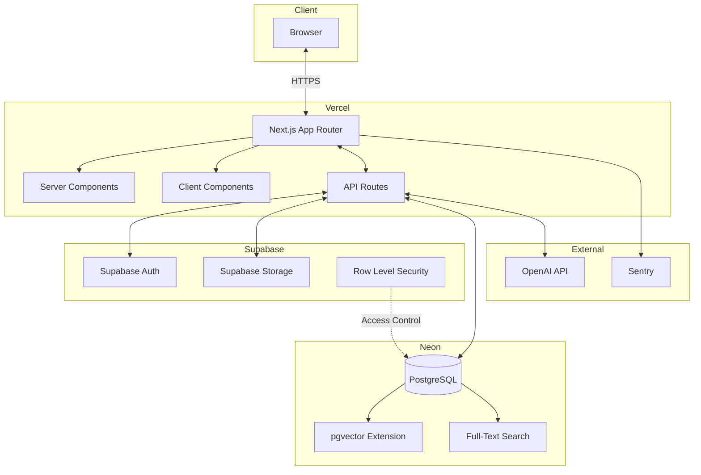
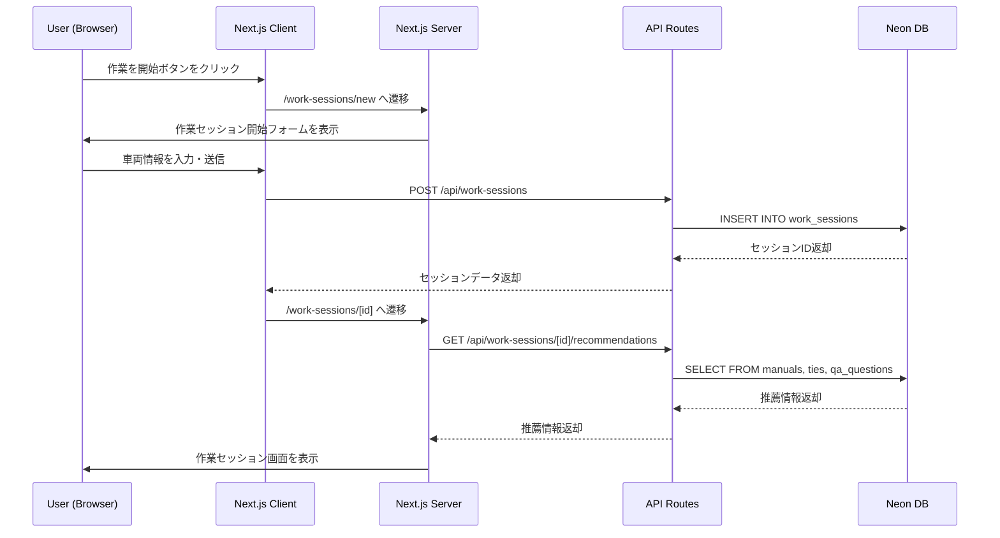
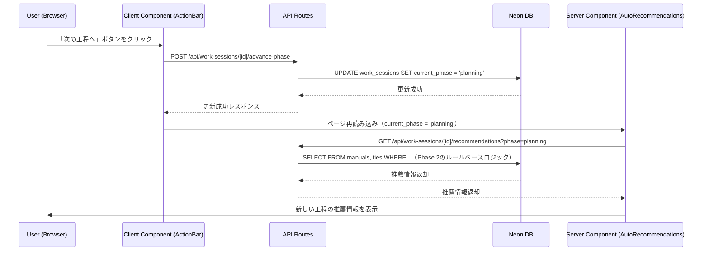
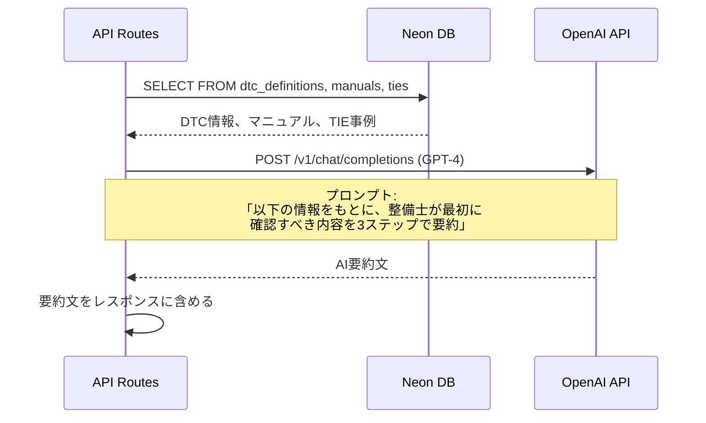
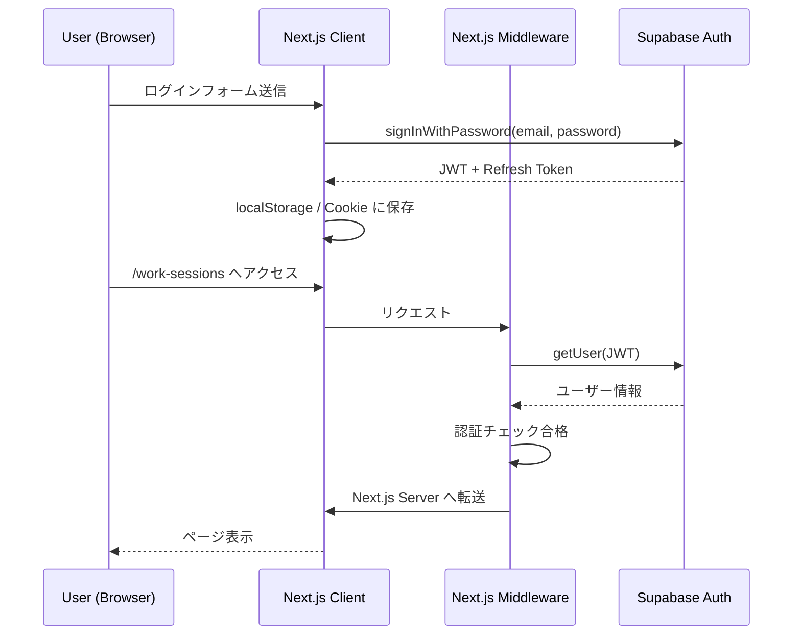

# システムアーキテクチャ設計書

**プロジェクト**: e-library Next  
**バージョン**: 1.1  
**作成日**: 2026年6月17日  
**最終更新日**: 2026年6月17日  

---

## 目次

1. [概要](#1-概要)
2. [技術スタック](#2-技術スタック)
3. [アーキテクチャ概要](#3-アーキテクチャ概要)
4. [コンポーネント設計](#4-コンポーネント設計)
5. [データフロー](#5-データフロー)
6. [セキュリティアーキテクチャ](#6-セキュリティアーキテクチャ)
7. [スケーラビリティとパフォーマンス](#7-スケーラビリティとパフォーマンス)
8. [監視とロギング](#8-監視とロギング)

---

## 1. 概要

e-library Nextは、自動車整備士向けの作業フロー駆動型情報提示システムです。本ドキュメントでは、システム全体の技術構成、コンポーネント間の連携、および実装上の重要な設計方針を定義します。

### 1.1 設計方針

- **モダンスタック**: Next.js 14 (App Router)、TypeScript、Supabase、Neonを採用し、開発速度と保守性を両立
- **Server/Client分離**: Next.jsのServer ComponentsとClient Componentsを適切に使い分け、パフォーマンスとインタラクティビティを最適化
- **BaaS活用**: Supabaseを活用し、認証、ストレージ、Row Level Security（RLS）をマネージドサービスで実現
- **サーバーレス**: Vercel + Neonのサーバーレスアーキテクチャにより、インフラ管理コストを削減

---

## 2. 技術スタック

### 2.1 フロントエンド

| レイヤー | 技術 | バージョン | 選定理由 |
|---|---|---|---|
| フレームワーク | Next.js (App Router) | 14.x | SSR/SSG、ルーティング、API Routes統合、React Server Componentsサポート |
| 言語 | TypeScript | 5.x | 型安全性、保守性向上、開発体験の向上 |
| UIライブラリ | Tailwind CSS + Headless UI | 3.x / 1.x | 迅速なUI構築、一貫したデザインシステム、カスタマイズ性 |
| 状態管理 | Zustand | 4.x | 軽量、シンプル、Server Components対応、Reduxより学習コスト低 |
| フォーム管理 | React Hook Form | 7.x | パフォーマンス、バリデーション、型安全性 |
| PDF表示 | react-pdf | 7.x | PDFマニュアルの表示 |

### 2.2 バックエンド

| レイヤー | 技術 | バージョン | 選定理由 |
|---|---|---|---|
| API | Next.js API Routes | 14.x | フロントエンドと同一リポジトリ、型共有が容易 |
| BaaS | Supabase | 最新 | 認証、ストレージ、リアルタイム機能統合、Row Level Security |
| データベース | Neon (PostgreSQL) | PostgreSQL 15 | サーバーレス、スケーラビリティ、全文検索・ベクトル検索対応（pgvector） |
| AI | OpenAI API (GPT-4) | gpt-4-turbo | 要約、自然言語処理、高精度 |
| ベクトル検索 | pgvector | 0.5.x | PostgreSQL拡張、OpenAI Embeddingsとの連携 |

### 2.3 インフラ・DevOps

| レイヤー | 技術 | 選定理由 |
|---|---|---|
| ホスティング | Vercel | Next.js最適化、自動デプロイ、グローバルCDN、Edge Functions |
| CI/CD | Vercel (GitHub連携) | main ブランチへのマージで自動デプロイ |
| パフォーマンス監視 | Vercel Analytics | リアルタイムパフォーマンス監視、Web Vitals |
| エラートラッキング | Sentry | エラー監視、スタックトレース、アラート |
| バージョン管理 | GitHub | プライベートリポジトリ、プルリクエストベース開発 |

### 2.4 外部サービス

| サービス | 用途 | Phase |
|---|---|---|
| OpenAI API | AI要約、ベクトル検索（Embeddings） | Phase 2-3 |
| Supabase Auth | 認証（メール認証） | Phase 2 |
| Supabase Storage | マニュアルPDF、画像保管 | Phase 2 |
| Vercel Analytics | パフォーマンスモニタリング | Phase 2 |
| Sentry | エラートラッキング | Phase 2 |

---

## 3. アーキテクチャ概要

### 3.1 システム構成図



### 3.2 各コンポーネントの役割

#### 3.2.1 フロントエンド層（Vercel）

**Next.js App Router**
- ルーティング、SSR/SSG、Server Componentsのエントリーポイント
- `/app` ディレクトリベースのファイルシステムルーティング
- 静的生成（SSG）と動的レンダリング（SSR）の自動最適化

**Server Components**
- サーバー側でのみ実行されるコンポーネント（デフォルト）
- データベースへの直接アクセス、API Routesへのfetch
- HTML生成後、クライアントにハイドレーション不要なマークアップを送信
- 使用例: `AutoRecommendations`, `ManualList`, `TIEList`

**Client Components**
- クライアント側で実行されるインタラクティブなコンポーネント
- `'use client'` ディレクティブで明示的に宣言
- イベントハンドリング、状態管理（useState, Zustand）、ブラウザAPI使用
- 使用例: `WorkSessionHeader`, `AIAssistant`, `ActionBar`

**API Routes**
- `/app/api` ディレクトリ配下のRoute Handlers
- RESTful API設計、JSON形式のリクエスト/レスポンス
- Supabase Auth、Neon DB、OpenAI APIとの連携
- 使用例: `/api/work-sessions`, `/api/work-sessions/[id]/recommendations`

#### 3.2.2 認証・ストレージ層（Supabase）

**Supabase Auth**
- メール認証（メールアドレス + パスワード）
- JWT（JSON Web Token）ベースのセッション管理
- Next.js Middlewareでの認証チェック

**Supabase Storage**
- マニュアルPDF、TIE画像、ユーザーアバターの保管
- バケット単位でのアクセス制御（public/private）
- CDNによる高速配信

**Row Level Security（RLS）**
- PostgreSQL（Neon）のテーブルに対するアクセス制御
- メーカー別・ディーラー別のデータ分離
- ユーザーの所属情報（dealer_id, maker_id）を基に、自動的にデータをフィルタリング

#### 3.2.3 データベース層（Neon）

**PostgreSQL**
- リレーショナルデータベース（ACID準拠）
- テーブル: users, dealers, makers, work_sessions, manuals, ties, qa_questions, qa_answers, session_logs, dtc_definitions, warnings
- インデックス、外部キー制約、ENUM型、配列型（TEXT[]）、ベクトル型（vector）のサポート

**pgvector Extension**
- ベクトル検索（意味的類似検索）の実現
- OpenAI Embeddingsで生成したベクトルを格納（vector カラム）
- 類似度計算（コサイン類似度、ユークリッド距離）

**Full-Text Search**
- PostgreSQLの全文検索機能（tsvector, tsquery）
- 日本語検索の最適化（pg_bigmなどの拡張も検討可能）

#### 3.2.4 外部API層

**OpenAI API**
- **Embeddings API**: テキストのベクトル化（text-embedding-ada-002）
- **Chat Completions API**: AI要約、自然言語処理（GPT-4）
- レート制限対策: APIキー管理、リトライロジック、キャッシング

**Sentry**
- エラー監視、スタックトレース、パフォーマンスプロファイリング
- アラート設定（Slack, Email）

---

## 4. コンポーネント設計

### 4.1 コンポーネント階層図

```mermaid
graph TD
    A[app/layout.tsx - Root Layout - Server Component] --> B[app/page.tsx - Top Page - Server Component]
    A --> C[app/work-sessions/new/page.tsx - Session Form - Server Component]
    A --> D[app/work-sessions/[id]/page.tsx - Session Detail - Server Component]
    
    D --> E[WorkSessionHeader - Client Component]
    D --> F[AutoRecommendations - Server Component]
    F --> G[AIAssistant - Client Component]
    F --> H[ManualList - Server Component]
    F --> I[TIEList - Server Component]
    F --> J[QAList - Server Component]
    D --> K[ActionBar - Client Component]
    
    B --> L[StartSessionButton - Client Component]
    B --> M[ActiveSessionsList - Server Component]
```

### 4.2 主要コンポーネント仕様

#### 4.2.1 WorkSessionHeader（Client Component）

**ファイルパス**: `app/work-sessions/[id]/components/WorkSessionHeader.tsx`

**Props:**
```typescript
interface WorkSessionHeaderProps {
  session: {
    vehicleModel: string;
    modelYear: number;
    vin: string | null;
    symptom: string | null;
    dtc: string[];
    currentPhase: Phase;
    startedAt: Date;
  };
  onPhaseChange: (phase: Phase) => void;
}

type Phase = 'intake' | 'diagnosis' | 'planning' | 'execution' | 'verification' | 'delivery';
```

**状態管理:**
- ローカル状態（useState）: なし
- グローバル状態: なし（親コンポーネントから props で受け取る）

**責務:**
- 作業コンテキストの表示（車種、VIN、症状、DTC、工程、経過時間）
- 工程変更ボタンの表示とイベントハンドリング

**レンダリング:**
```typescript
'use client'

export function WorkSessionHeader({ session, onPhaseChange }: WorkSessionHeaderProps) {
  return (
    <div className="bg-blue-900 text-white p-4">
      <div className="flex justify-between">
        <div>
          <span>車種: {session.vehicleModel}</span> | 
          <span>年式: {session.modelYear}</span> | 
          <span>VIN: {session.vin || 'N/A'}</span>
        </div>
        <div>
          <span>工程: {PHASE_LABELS[session.currentPhase]}</span> | 
          <span>経過時間: {formatElapsedTime(session.startedAt)}</span>
        </div>
      </div>
    </div>
  );
}
```

#### 4.2.2 AutoRecommendations（Server Component）

**ファイルパス**: `app/work-sessions/[id]/components/AutoRecommendations.tsx`

**Props:**
```typescript
interface AutoRecommendationsProps {
  sessionId: string;
  phase: Phase;
}
```

**データフェッチング:**
```typescript
export async function AutoRecommendations({ sessionId, phase }: AutoRecommendationsProps) {
  const recommendations = await fetch(
    `/api/work-sessions/${sessionId}/recommendations?phase=${phase}`, 
    { cache: 'no-store' } // リアルタイム性重視
  ).then(res => res.json());
  
  return (
    <div className="space-y-6">
      <AIAssistant summary={recommendations.ai_summary} />
      <ManualList manuals={recommendations.manuals} />
      <TIEList ties={recommendations.ties} />
      <QAList questions={recommendations.qa_questions} />
      <WarningList warnings={recommendations.warnings} />
    </div>
  );
}
```

**責務:**
- 工程別自動情報提示データのフェッチ（API Routes経由）
- 子コンポーネントへのデータ受け渡し
- Server Component のため、データベースへの直接アクセスも可能（今回はAPI Routes経由を選択）

#### 4.2.3 ActionBar（Client Component）

**ファイルパス**: `app/work-sessions/[id]/components/ActionBar.tsx`

**Props:**
```typescript
interface ActionBarProps {
  sessionId: string;
  currentPhase: Phase;
  onComplete: () => void;
}
```

**状態管理:**
- グローバル状態（Zustand）: セッション状態管理（isLoading, errorなど）

**責務:**
- アクションボタンの表示（次の工程へ、追加情報を探す、質問を投稿、作業を完了）
- ボタンクリック時のイベントハンドリング（API呼び出し、状態更新）

**レンダリング:**
```typescript
'use client'

import { useWorkSessionStore } from '@/stores/workSessionStore'

export function ActionBar({ sessionId, currentPhase, onComplete }: ActionBarProps) {
  const { isLoading, setLoading } = useWorkSessionStore()
  
  const handleNextPhase = async () => {
    setLoading(true)
    await fetch(`/api/work-sessions/${sessionId}/advance-phase`, { method: 'POST' })
    setLoading(false)
  }
  
  return (
    <div className="fixed bottom-0 left-0 right-0 bg-white shadow-lg p-4">
      <div className="flex justify-center space-x-4">
        <button onClick={handleNextPhase} disabled={isLoading}>
          次の工程へ
        </button>
        <button>追加情報を探す</button>
        <button>質問を投稿</button>
        <button onClick={onComplete}>作業を完了</button>
      </div>
    </div>
  );
}
```

### 4.3 Server/Client コンポーネントの使い分け基準

| 条件 | 使用するコンポーネント | 理由 |
|---|---|---|
| データベースへの直接アクセスが必要 | Server Component | サーバー側でのみ実行、データベース接続情報を隠蔽 |
| イベントハンドリングが必要（onClick, onChange） | Client Component | ブラウザAPIが必要 |
| 状態管理が必要（useState, useReducer） | Client Component | Reactのフックはクライアント側でのみ動作 |
| 静的な表示のみ（データフェッチ後） | Server Component | ハイドレーション不要、初期表示が高速 |
| リアルタイム更新が必要（WebSocket, SSE） | Client Component | ブラウザAPIが必要 |

---

## 5. データフロー

### 5.1 作業セッション開始のフロー



### 5.2 工程別自動情報提示のフロー



### 5.3 AI要約生成のフロー（Phase 3）



---

## 6. セキュリティアーキテクチャ

### 6.1 認証フロー



### 6.2 Row Level Security（RLS）

Neon DBのテーブルに対して、Supabaseの認証情報を基にアクセス制御を実施：

**例: work_sessions テーブル**
```sql
CREATE POLICY "Users can only see their own dealer's work sessions"
ON work_sessions
FOR SELECT
USING (dealer_id = (SELECT dealer_id FROM users WHERE id = auth.uid()));
```

**例: manuals テーブル**
```sql
CREATE POLICY "Users can only see their own maker's manuals"
ON manuals
FOR SELECT
USING (maker_id IN (
  SELECT m.id FROM makers m
  JOIN dealers d ON d.maker_id = m.id
  JOIN users u ON u.dealer_id = d.id
  WHERE u.id = auth.uid()
));
```

### 6.3 APIセキュリティ

- **HTTPS通信**: Vercelのデフォルト設定により、全ての通信はHTTPS（TLS 1.2以上）
- **JWT検証**: Next.js MiddlewareでSupabase JWTを検証
- **CORS設定**: API Routesで適切なCORSヘッダーを設定（Same-Origin Policy）
- **レート制限**: Vercel Edge Functionsでのレート制限実装を検討
- **環境変数**: 機密情報（API キー、DB接続情報）は `.env.local` で管理、Vercelの環境変数機能で本番環境に注入

---

## 7. スケーラビリティとパフォーマンス

### 7.1 スケーラビリティ戦略

**水平スケーリング**
- Vercel: 自動的にリクエスト数に応じてスケール（Edge Functions, Serverless Functions）
- Neon: 自動的に接続プールを管理、読み取りレプリカによるスケール

**キャッシング戦略**
- **Next.js Static Generation**: 静的ページ（Top Page, マニュアル一覧）はビルド時に生成
- **API Routes Cache**: `fetch` の `cache` オプションで制御（`'force-cache'`, `'no-store'`）
- **Supabase Storage CDN**: マニュアルPDFはCDN経由で配信

### 7.2 パフォーマンス最適化

**フロントエンド最適化**
- **Code Splitting**: Next.jsの自動コード分割（ページ単位、dynamic import）
- **Image Optimization**: `next/image` による画像最適化（WebP, 遅延読み込み）
- **Bundle Size**: `next-bundle-analyzer` でバンドルサイズを監視

**データベース最適化**
- **インデックス**: 頻繁にクエリされるカラムにインデックスを作成（`vehicle_model`, `dtc`, `related_dtc`）
- **クエリ最適化**: N+1問題の回避、JOINの適切な使用
- **接続プール**: Neonの接続プール機能を活用

**API最適化**
- **レスポンス圧縮**: Vercelのデフォルト設定により、gzip圧縮が有効
- **並列処理**: 複数のデータソースへのクエリを `Promise.all()` で並列実行

### 7.3 パフォーマンス目標

| 指標 | 目標値 | 測定方法 |
|---|---|---|
| First Contentful Paint (FCP) | 1.8秒以内 | Lighthouse, Vercel Analytics |
| Largest Contentful Paint (LCP) | 2.5秒以内 | Lighthouse, Vercel Analytics |
| Time to Interactive (TTI) | 3.8秒以内 | Lighthouse |
| API レスポンスタイム | 1秒以内 | Vercel Analytics, カスタムメトリクス |
| AI要約生成 | 5秒以内 | OpenAI API レスポンスタイム |

---

## 8. 監視とロギング

### 8.1 監視ツール

**Vercel Analytics**
- リアルタイムパフォーマンス監視（Web Vitals）
- ページビュー、ユニークビジター、地理的分布

**Sentry**
- エラー監視、スタックトレース
- パフォーマンスプロファイリング（Transaction, Span）
- アラート設定（Slack, Email）

### 8.2 ロギング戦略

**アプリケーションログ**
- `console.log`, `console.error` → Vercel Logsに自動転送
- 構造化ログ（JSON形式）の推奨

**監査ログ**
- `session_logs` テーブル: ユーザーの行動ログ（閲覧、検索、フィードバック）
- 1年間保持、分析ダッシュボードで可視化

**エラーログ**
- Sentryで自動収集
- エラーレート、スタックトレース、ユーザーコンテキスト（user_id, session_id）

### 8.3 アラート設定

| アラート条件 | 通知先 | 対応アクション |
|---|---|---|
| エラーレート 5% 以上 | Slack, Email | 即座に調査、ロールバック検討 |
| API レスポンスタイム 3秒以上 | Slack | クエリ最適化、キャッシュ見直し |
| 稼働率 99.5% 未満 | Slack, Email | インフラ状況確認、Vercel Status確認 |
| OpenAI API レート制限 | Slack | APIキー管理、リトライロジック見直し |

---

## 付録

### A. 開発環境構築

**必要なツール**
- Node.js 18.x以上
- npm または yarn
- Git
- VSCode（推奨エディタ）

**環境変数（`.env.local`）**
```bash
# Supabase
NEXT_PUBLIC_SUPABASE_URL=https://xxxxx.supabase.co
NEXT_PUBLIC_SUPABASE_ANON_KEY=xxxxx
SUPABASE_SERVICE_ROLE_KEY=xxxxx

# Neon
DATABASE_URL=postgresql://xxxxx@xxxxx.neon.tech/xxxxx

# OpenAI
OPENAI_API_KEY=sk-xxxxx

# Sentry
NEXT_PUBLIC_SENTRY_DSN=https://xxxxx@sentry.io/xxxxx
```

### B. デプロイフロー

1. `main` ブランチにマージ
2. Vercelが自動的にビルド・デプロイ
3. Vercel Analyticsでパフォーマンスを監視
4. Sentryでエラーを監視

---

**以上、システムアーキテクチャ設計書v1.1**
