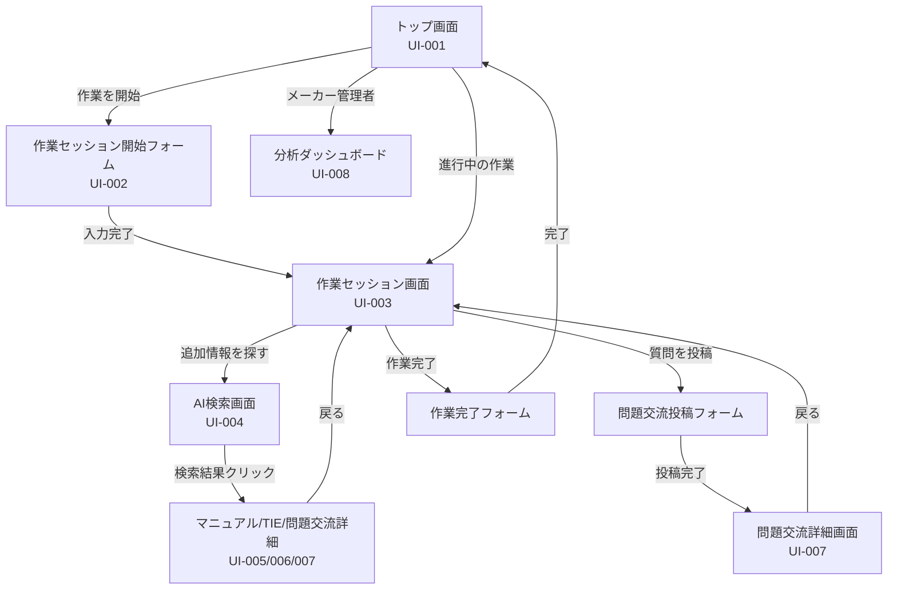
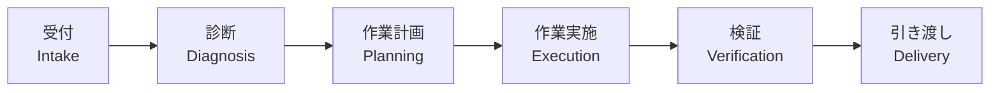

# UI/UX設計書

**プロジェクト**: e-library Next  
**バージョン**: 1.1  
**作成日**: 2026年6月17日  
**最終更新日**: 2026年6月17日  

---

## 目次

1. [概要](#1-概要)
2. [デザインコンセプト](#2-デザインコンセプト)
3. [デザインシステム](#3-デザインシステム)
4. [画面一覧](#4-画面一覧)
5. [画面遷移図](#5-画面遷移図)
6. [主要画面ワイヤーフレーム](#6-主要画面ワイヤーフレーム)
7. [UIコンポーネント](#7-uiコンポーネント)
8. [レスポンシブデザイン](#8-レスポンシブデザイン)
9. [アクセシビリティ](#9-アクセシビリティ)

---

## 1. 概要

e-library Nextは、自動車整備士向けの作業フロー駆動型情報提示システムです。本ドキュメントでは、ユーザーインターフェース（UI）とユーザー体験（UX）の設計方針、画面構成、デザインシステムを定義します。

### 1.1 設計の目的

- **作業フロー中心のUI**: 検索ではなく、作業セッションを中心に据えた設計
- **プロアクティブな情報提示**: ユーザーが探す前に、必要な情報が届く体験
- **視認性と安全性**: 警告・注意事項を目立たせ、安全な作業をサポート
- **モダンで信頼感のあるデザイン**: 整備士が安心して使える、プロフェッショナルなデザイン

---

## 2. デザインコンセプト

### 2.1 コアコンセプト

**「探すをなくす、届ける情報体験」**

- **プロアクティブ**: システムが「待っている」のではなく、整備士の作業を「サポートしている」印象
- **作業フロー中心**: 検索バーではなく、作業セッション画面が中心
- **情報の優先順位**: 現在の工程で最も重要な情報を最上部に配置
- **視認性**: 警告・注意事項は赤色背景で常時表示

### 2.2 デザイン原則

1. **明確性（Clarity）**: 情報の階層を明確にし、ユーザーが迷わない設計
2. **一貫性（Consistency）**: 同じ操作は同じ結果を生む、一貫したインタラクション
3. **効率性（Efficiency）**: 最小限のクリック数で目的の情報にアクセス
4. **安全性（Safety）**: 警告・注意事項を目立たせ、誤操作を防ぐ

---

## 3. デザインシステム

### 3.1 カラーパレット

#### 3.1.1 ブランドカラー

| カラー名 | 16進コード | 用途 |
|---|---|---|
| **Primary（濃紺）** | `#1E3A8A` | ヘッダー、主要ボタン、ナビゲーション |
| **Secondary（ライトブルー）** | `#3B82F6` | リンク、サブボタン、ホバー時の背景 |
| **Accent（オレンジ）** | `#F59E0B` | 次アクションボタン、注意喚起 |
| **Warning（赤）** | `#DC2626` | 警告、禁止事項、危険な操作 |
| **Success（緑）** | `#10B981` | 解決済み、承認済み、成功メッセージ |

#### 3.1.2 ニュートラルカラー

| カラー名 | 16進コード | 用途 |
|---|---|---|
| **Background** | `#F9FAFB` | 背景 |
| **Surface** | `#FFFFFF` | カード、モーダル、ドロップダウンの背景 |
| **Text Primary** | `#1F2937` | 本文、見出し |
| **Text Secondary** | `#6B7280` | サブテキスト、キャプション |
| **Border** | `#E5E7EB` | カードの境界線、セパレーター |

### 3.2 タイポグラフィ

#### 3.2.1 フォントファミリー

- **日本語**: Noto Sans JP (Google Fonts)
  - 視認性が高く、ビジネスアプリケーションに適したフォント
- **欧文・数字**: Inter (Google Fonts)
  - 可読性が高く、モダンなデザイン

#### 3.2.2 フォントサイズと行高

| 要素 | サイズ | 行高 | 用途 |
|---|---|---|---|
| **H1（見出し1）** | 24px / 1.5rem | 32px | ページタイトル |
| **H2（見出し2）** | 20px / 1.25rem | 28px | セクション見出し |
| **H3（見出し3）** | 18px / 1.125rem | 24px | カードタイトル、小見出し |
| **本文** | 16px / 1rem | 1.6 | 一般的なテキスト |
| **キャプション** | 14px / 0.875rem | 1.4 | 補足情報、ラベル |
| **小テキスト** | 12px / 0.75rem | 1.3 | タイムスタンプ、メタ情報 |

#### 3.2.3 フォントウェイト

- **Regular（400）**: 本文
- **Medium（500）**: ボタンテキスト、ラベル
- **SemiBold（600）**: H3見出し、強調
- **Bold（700）**: H1, H2見出し

### 3.3 スペーシング

**8pxグリッドシステム**を採用：

| 変数 | 値 | 用途 |
|---|---|---|
| `space-1` | 4px | 最小の余白、インラインアイコンの間隔 |
| `space-2` | 8px | ボタン内の余白、テキスト間隔 |
| `space-3` | 12px | カード内の要素間隔 |
| `space-4` | 16px | カード間の余白、セクション間隔（標準） |
| `space-6` | 24px | セクション見出しの余白 |
| `space-8` | 32px | 大きなセクションの区切り |
| `space-12` | 48px | ページ上下の余白 |

### 3.4 角丸

| 変数 | 値 | 用途 |
|---|---|---|
| `rounded-sm` | 4px | 小さなボタン、チップ |
| `rounded` | 8px | カード、インプット、ボタン（標準） |
| `rounded-lg` | 12px | 大きなカード、モーダル |
| `rounded-full` | 9999px | アイコンボタン、バッジ |

### 3.5 シャドウ

| 変数 | 値 | 用途 |
|---|---|---|
| `shadow-sm` | `0 1px 2px rgba(0, 0, 0, 0.05)` | カード（デフォルト） |
| `shadow` | `0 1px 3px rgba(0, 0, 0, 0.1)` | カード（ホバー時） |
| `shadow-md` | `0 4px 6px rgba(0, 0, 0, 0.1)` | ドロップダウン、モーダル |
| `shadow-lg` | `0 10px 15px rgba(0, 0, 0, 0.1)` | 浮き上がる要素（FAB、アクションバー） |

---

## 4. 画面一覧

| 画面ID | 画面名 | 説明 | 主要ユーザー |
|---|---|---|---|
| **UI-001** | トップ画面（作業開始画面） | 「作業を開始する」ボタン、進行中の作業セッション一覧 | 整備士 |
| **UI-002** | 作業セッション開始フォーム | 車両情報入力（車種、年式、VIN、症状、DTC） | 整備士 |
| **UI-003** | 作業セッション画面 | 工程別自動情報提示、作業コンテキストヘッダー、アクションバー | 整備士 |
| **UI-004** | AI検索画面 | 自然言語検索、検索結果表示 | 整備士 |
| **UI-005** | マニュアル詳細画面 | PDF表示、関連TIE・問題交流の表示 | 整備士 |
| **UI-006** | TIE詳細画面 | TIE内容表示、関連マニュアル・問題交流の表示 | 整備士 |
| **UI-007** | 問題交流詳細画面 | 質問・回答表示、回答投稿フォーム | 整備士 |
| **UI-008** | メーカー向け分析ダッシュボード | 利用状況、頻出症状、未解決課題、自動提示精度 | メーカー管理者 |

---

## 5. 画面遷移図

### 5.1 全体遷移図



### 5.2 作業セッション画面内の工程遷移



**各工程で提示される情報**:
- **受付**: 車両情報確認、過去の作業履歴
- **診断**: DTC定義、診断フローチャート、類似事例
- **作業計画**: サービスマニュアル、工数見積もり
- **作業実施**: ステップバイステップの手順、注意事項
- **検証**: チェックリスト、テスト項目
- **引き渡し**: 納車チェック、顧客説明用の資料

---

## 6. 主要画面ワイヤーフレーム

### 6.1 トップ画面（UI-001）

```
+------------------------------------------------------------------+
|  [Logo] e-library Next          [ユーザー名] [ログアウト]          |
+------------------------------------------------------------------+
|                                                                  |
|                  ┌────────────────────────────┐                  |
|                  │                            │                  |
|                  │   [作業を開始する]           │                  |
|                  │                            │                  |
|                  └────────────────────────────┘                  |
|                                                                  |
+------------------------------------------------------------------+
|                                                                  |
|  進行中の作業セッション:                                           |
|                                                                  |
|  ┌──────────────────────────────────────────────────────────┐  |
|  │ 車種: Model A | 年式: 2024 | 症状: エンジンチェックランプ点灯   │  |
|  │ 工程: 診断 | 経過時間: 00:15:32                              │  |
|  │ [続きから作業する]                                           │  |
|  └──────────────────────────────────────────────────────────┘  |
|                                                                  |
+------------------------------------------------------------------+
```

**主要要素**:
- **「作業を開始する」ボタン**: 新規作業セッションの開始（UI-002へ遷移）
- **進行中の作業セッション一覧**: 未完了の作業セッションをカード形式で表示
- **「続きから作業する」ボタン**: 該当の作業セッション画面（UI-003）へ遷移

---

### 6.2 作業セッション開始フォーム（UI-002）

```
+------------------------------------------------------------------+
|  [Logo] e-library Next          [ユーザー名] [ログアウト]          |
+------------------------------------------------------------------+
|                                                                  |
|  作業を開始する                                                   |
|                                                                  |
|  ┌──────────────────────────────────────────────────────────┐  |
|  │ 車種 *                                                      │  |
|  │ [▼ Model A を選択してください]                              │  |
|  │                                                             │  |
|  │ 年式 *                                                      │  |
|  │ [▼ 2024 を選択してください]                                │  |
|  │                                                             │  |
|  │ VIN（任意）                                                 │  |
|  │ [_________________________________]                         │  |
|  │                                                             │  |
|  │ 症状（任意）                                                │  |
|  │ [_______________________________________________]           │  |
|  │                                                             │  |
|  │ DTC（任意）                                                 │  |
|  │ [+ DTCを追加]  [P0420] [x]  [P0300] [x]                    │  |
|  │                                                             │  |
|  │                     [キャンセル] [作業を開始]                │  |
|  └──────────────────────────────────────────────────────────┘  |
|                                                                  |
+------------------------------------------------------------------+
```

**主要要素**:
- **車種・年式**: ドロップダウンで選択（必須）
- **VIN**: テキスト入力（任意、17桁）
- **症状**: テキストエリア（任意）
- **DTC**: タグ入力（複数選択可、任意）
- **「作業を開始」ボタン**: バリデーション後、作業セッション画面（UI-003）へ遷移

---

### 6.3 作業セッション画面（UI-003）

```
+------------------------------------------------------------------+
|  [Logo] e-library Next          [ユーザー名] [ログアウト]          |
+------------------------------------------------------------------+
|  車種: Model A | 年式: 2024 | VIN: JN1XXXXXXXXXXXXX               |
|  工程: 診断 (Diagnosis) | 経過時間: 00:15:32                       |
+------------------------------------------------------------------+
|                                                                  |
|  [AI Assistant Section - ライトブルー背景]                        |
|  このDTC P0420 は、触媒効率低下を示しています。                     |
|  まず以下を確認してください:                                       |
|  1. O2センサーの配線接続                                           |
|  2. センサーの動作確認                                             |
|  3. ECUとの通信状態                                               |
|                                                                  |
+------------------------------------------------------------------+
|                                                                  |
|  [公式マニュアル]                                                  |
|  ┌──────────────────────────────────────────────────────────┐  |
|  │ サービスマニュアル: P0420 - 触媒効率低下                        │  |
|  │ > 診断フローチャート (PDF p.145)                                │  |
|  │ [詳細を見る]                                                  │  |
|  └──────────────────────────────────────────────────────────┘  |
|                                                                  |
+------------------------------------------------------------------+
|                                                                  |
|  [類似TIE事例]                                                    |
|  ┌──────────────────────────────────────┐                      |
|  │ TIE#1234: Model A 2024年 P0420対応事例 │                      |
|  │ 症状: 触媒効率警告灯点灯                │                      |
|  │ 対応: O2センサー交換で解決              │                      |
|  │ [詳細を見る] [役立った: 15]            │                      |
|  └──────────────────────────────────────┘                      |
|                                                                  |
+------------------------------------------------------------------+
|                                                                  |
|  [⚠️ 注意事項 - 赤色背景]                                         |
|  ⚠️ 作業前に必ずイグニッションOFFを確認                           |
|  ⚠️ O2センサー交換時はトルク値 55Nmを厳守                        |
|                                                                  |
+------------------------------------------------------------------+
|  [アクションバー - 画面下部固定]                                   |
|  [次の工程へ] [追加情報を探す] [質問を投稿] [作業を完了]           |
+------------------------------------------------------------------+
```

**主要要素**:
- **作業コンテキストヘッダー**: 車種、年式、VIN、工程、経過時間
- **AIアシスト要約**: DTC定義マスタからのテンプレート文、またはAI生成の要約
- **公式マニュアル**: 車種・DTCに関連するマニュアル
- **類似TIE事例**: 類似症状の修理事例
- **注意事項**: 警告・禁止事項（赤色背景で目立たせる）
- **アクションバー**: 次の工程へ進む、追加検索、質問投稿、作業完了

---

### 6.4 AI検索画面（UI-004）

```
+------------------------------------------------------------------+
|  [Logo] e-library Next          [ユーザー名] [ログアウト]          |
+------------------------------------------------------------------+
|                                                                  |
|  追加情報を探す                                                   |
|                                                                  |
|  ┌──────────────────────────────────────────────────────────┐  |
|  │ [🔍] エンジンがかからない                                    │  |
|  │                                                  [検索]      │  |
|  └──────────────────────────────────────────────────────────┘  |
|                                                                  |
|  検索結果（15件）:                                                |
|                                                                  |
|  [マニュアル] エンジン始動トラブルシューティング                    |
|  > エンジンがかからない場合、まずバッテリー電圧を確認...             |
|  関連性: ★★★★★ (0.92)                                           |
|                                                                  |
|  [TIE事例] Model A エンジン始動不良事例                            |
|  > バッテリー電圧低下により始動不良が発生...                        |
|  関連性: ★★★★☆ (0.88)                                           |
|                                                                  |
+------------------------------------------------------------------+
```

**主要要素**:
- **検索バー**: 自然言語での検索入力
- **検索結果**: マニュアル、TIE、問題交流の混合表示
- **関連性スコア**: 星評価で表示（0.8以上は★5つ）

---

### 6.5 マニュアル詳細画面（UI-005）

```
+------------------------------------------------------------------+
|  [Logo] e-library Next          [ユーザー名] [ログアウト]          |
+------------------------------------------------------------------+
|  [← 戻る]                                                        |
|                                                                  |
|  サービスマニュアル: P0420 - 触媒効率低下                          |
|  車種: Model A | 年式: 2024 | セクション: エンジン / 排気系統       |
|                                                                  |
+------------------------------------------------------------------+
|  [PDF表示エリア]                                                  |
|  ┌──────────────────────────────────────────────────────────┐  |
|  │                                                             │  |
|  │  [PDFビューアー]                                             │  |
|  │  診断フローチャート                                          │  |
|  │  - O2センサーの配線確認                                      │  |
|  │  - センサーの動作確認                                        │  |
|  │                                                             │  |
|  └──────────────────────────────────────────────────────────┘  |
|                                                                  |
|  [関連情報]                                                       |
|  類似TIE事例: TIE#1234 Model A 2024年 P0420対応事例               |
|  問題交流: P0420のよくある原因は？                                 |
|                                                                  |
+------------------------------------------------------------------+
```

**主要要素**:
- **PDFビューアー**: `react-pdf` を使用してPDFを表示
- **関連情報**: 関連TIE、問題交流へのリンク

---

### 6.6 TIE詳細画面（UI-006）

```
+------------------------------------------------------------------+
|  [Logo] e-library Next          [ユーザー名] [ログアウト]          |
+------------------------------------------------------------------+
|  [← 戻る]                                                        |
|                                                                  |
|  TIE#1234: Model A 2024年 P0420対応事例                           |
|  車種: Model A | 年式: 2024 | DTC: P0420 | 承認済み               |
|                                                                  |
+------------------------------------------------------------------+
|  【症状】                                                         |
|  触媒効率警告灯点灯、アイドリング時の異音                          |
|                                                                  |
|  【原因】                                                         |
|  O2センサーの劣化による触媒効率低下                                |
|                                                                  |
|  【対処法】                                                       |
|  1. O2センサーの配線接続を確認                                     |
|  2. O2センサーを交換（トルク値 55Nm）                             |
|  3. 触媒の状態を確認（必要に応じて交換）                           |
|  4. DTC消去後、テスト走行で確認                                   |
|                                                                  |
|  [役立った] (15人) | [役立たなかった] (0人)                        |
|                                                                  |
|  [関連マニュアル]                                                  |
|  サービスマニュアル: P0420 - 触媒効率低下                          |
|                                                                  |
+------------------------------------------------------------------+
```

**主要要素**:
- **症状・原因・対処法**: 構造化されたTIE情報
- **フィードバックボタン**: 役立った/役立たなかった
- **関連マニュアル**: 関連マニュアルへのリンク

---

### 6.7 問題交流詳細画面（UI-007）

```
+------------------------------------------------------------------+
|  [Logo] e-library Next          [ユーザー名] [ログアウト]          |
+------------------------------------------------------------------+
|  [← 戻る]                                                        |
|                                                                  |
|  P0420のよくある原因は？                                          |
|  投稿者: 佐藤健太 | 2026/06/10 09:00 | 車種: Model A | 解決済み   |
|                                                                  |
+------------------------------------------------------------------+
|  【質問】                                                         |
|  Model Aで頻繁にP0420が出ます。よくある原因を教えてください。      |
|                                                                  |
+------------------------------------------------------------------+
|  【回答】                                                         |
|  ┌──────────────────────────────────────────────────────────┐  |
|  │ [ベストアンサー]                                             │  |
|  │ 田中一郎 | 2026/06/10 10:30                                   │  |
|  │                                                             │  |
|  │ O2センサーの劣化が最も多い原因です。まずO2センサーの         │  |
|  │ 状態を確認してください。                                     │  |
|  └──────────────────────────────────────────────────────────┘  |
|                                                                  |
|  ┌──────────────────────────────────────────────────────────┐  |
|  │ 山田裕子 | 2026/06/10 11:00                                   │  |
|  │                                                             │  |
|  │ 触媒自体の劣化もあります。O2センサー交換後も改善しない        │  |
|  │ 場合は触媒の確認をお勧めします。                             │  |
|  └──────────────────────────────────────────────────────────┘  |
|                                                                  |
|  [回答を投稿する]                                                 |
|  ┌──────────────────────────────────────────────────────────┐  |
|  │ [回答を入力してください...]                                  │  |
|  │                                                  [投稿]      │  |
|  └──────────────────────────────────────────────────────────┘  |
|                                                                  |
+------------------------------------------------------------------+
```

**主要要素**:
- **質問情報**: 投稿者、日時、車種、ステータス
- **回答一覧**: ベストアンサーを最上部に表示
- **回答投稿フォーム**: テキストエリアと「投稿」ボタン

---

### 6.8 メーカー向け分析ダッシュボード（UI-008）

```
+------------------------------------------------------------------+
|  [Logo] e-library Next          [ユーザー名] [ログアウト]          |
+------------------------------------------------------------------+
|                                                                  |
|  メーカー向け分析ダッシュボード                                   |
|                                                                  |
|  [月次サマリー]                                                   |
|  ┌──────────┬──────────┬──────────┬──────────┐              |
|  │ 総利用時間 │ アクティブ │ 自動提示  │ 検索利用率│              |
|  │   320h   │  ユーザー  │  利用率   │   15%    │              |
|  │          │   45人    │   85%    │          │              |
|  └──────────┴──────────┴──────────┴──────────┘              |
|                                                                  |
|  [頻出症状 TOP 5]                                                 |
|  1. P0420 - 触媒効率低下（50件）                                  |
|  2. P0300 - ランダム失火（32件）                                  |
|  3. P0171 - 燃料トリム異常（28件）                                |
|                                                                  |
|  [未解決課題]                                                     |
|  - Model B の P0440 に関連するマニュアルが不足                    |
|  - Model C の DTC P0102 の自動提示精度が低い（60%）               |
|                                                                  |
+------------------------------------------------------------------+
```

**主要要素**:
- **月次サマリー**: 総利用時間、アクティブユーザー、自動提示利用率、検索利用率
- **頻出症状**: DTC別の発生件数ランキング
- **未解決課題**: マニュアル不足、精度低下の警告

---

## 7. UIコンポーネント

### 7.1 ボタン

#### 7.1.1 プライマリボタン

**用途**: 主要なアクション（作業を開始、次の工程へ、投稿）

**スタイル**:
- 背景: `#1E3A8A`（Primary）
- テキスト: `#FFFFFF`
- 角丸: `8px`
- パディング: `12px 24px`
- ホバー時: 背景を10%暗く

**例**:
```tsx
<button className="bg-primary text-white px-6 py-3 rounded hover:bg-primary-dark">
  作業を開始
</button>
```

#### 7.1.2 セカンダリボタン

**用途**: 補助的なアクション（キャンセル、戻る）

**スタイル**:
- 背景: `#FFFFFF`
- 境界線: `1px solid #E5E7EB`
- テキスト: `#1F2937`
- 角丸: `8px`
- パディング: `12px 24px`
- ホバー時: 背景を `#F9FAFB` に変更

#### 7.1.3 アクセントボタン

**用途**: 次のアクションを促すボタン（次の工程へ）

**スタイル**:
- 背景: `#F59E0B`（Accent）
- テキスト: `#FFFFFF`

### 7.2 カード

**用途**: TIE、マニュアル、問題交流の表示

**スタイル**:
- 背景: `#FFFFFF`
- 境界線: `1px solid #E5E7EB`
- 角丸: `8px`
- シャドウ: `0 1px 2px rgba(0, 0, 0, 0.05)`
- パディング: `16px`
- ホバー時: シャドウを `0 1px 3px rgba(0, 0, 0, 0.1)` に変更

### 7.3 警告バナー

**用途**: 注意事項の表示

**スタイル**:
- 背景: `#FEE2E2`（赤の薄い背景）
- テキスト: `#DC2626`（Warning）
- アイコン: ⚠️
- 角丸: `8px`
- パディング: `12px 16px`

---

## 8. レスポンシブデザイン

### 8.1 ブレークポイント

| デバイス | ブレークポイント | レイアウト |
|---|---|---|
| **モバイル** | 〜768px | 1カラム、画面下部に固定アクションバー |
| **タブレット** | 768px〜1024px | 1カラム、サイドバーを折りたたみ |
| **デスクトップ** | 1024px〜 | 2カラム（メイン + サイドバー） |

### 8.2 モバイル対応

- **タッチターゲット**: 最小44x44px（Apple Human Interface Guidelines）
- **フォントサイズ**: 本文は16px以上（拡大なしで読める）
- **画像**: 遅延読み込み（Lazy Loading）、WebP形式

---

## 9. アクセシビリティ

### 9.1 WCAG 2.1準拠

- **レベル**: AA準拠を目標
- **コントラスト比**: テキストと背景のコントラスト比4.5:1以上
- **キーボードナビゲーション**: 全ての機能をキーボードで操作可能
- **スクリーンリーダー対応**: ARIAラベルの適切な使用

### 9.2 カラーコントラスト

| 組み合わせ | コントラスト比 | 評価 |
|---|---|---|
| `#1F2937` (Text) / `#FFFFFF` (Background) | 13.1:1 | AAA ✓ |
| `#FFFFFF` (Text) / `#1E3A8A` (Primary) | 10.5:1 | AAA ✓ |
| `#FFFFFF` (Text) / `#DC2626` (Warning) | 5.5:1 | AA ✓ |

---

**以上、UI/UX設計書v1.1**
