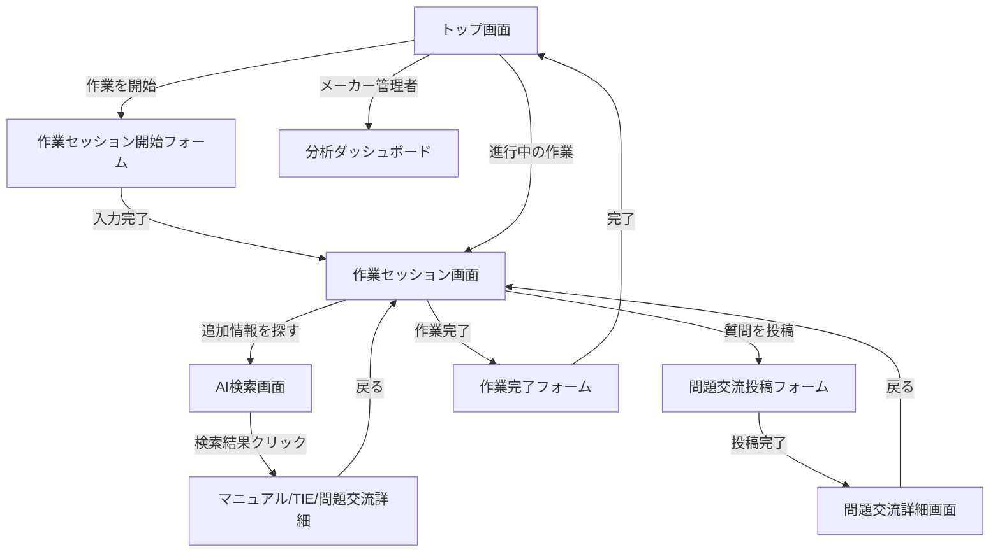
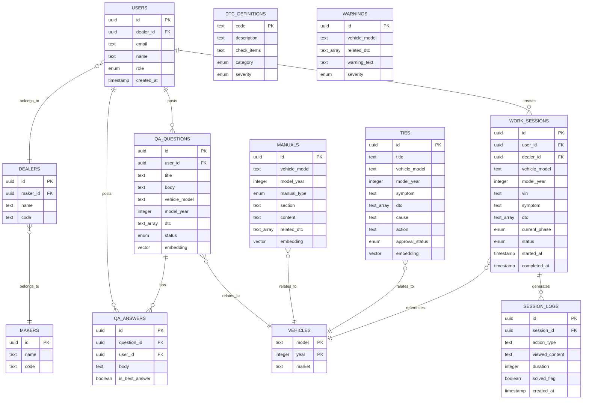
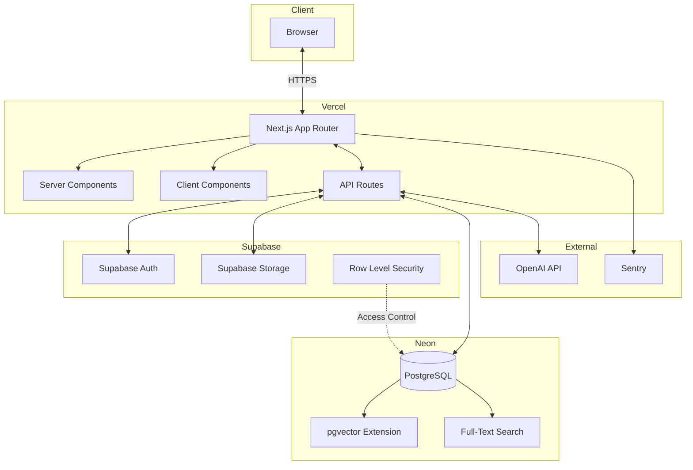

# e-library Next 詳細要件定義書

**バージョン**: 1.1  
**作成日**: 2026年6月16日  
**最終更新日**: 2026年6月17日  

**更新履歴**:
- v1.1 (2026年6月17日): レビュー結果を反映してブラッシュアップ
  - 1.6「弊社にとっての事業価値」を追加
  - 1.7「横展開可能性」を追加
  - 3.5「PoC計画」を追加
  - 4.2.2「工程別自動情報提示」のロジックを具体化（SQL文レベル）
  - 6.4「安全・品質・責任範囲」を追加
  - 7. データベース設計に「dtc_definitions」「warnings」テーブルを追加
  - 11.2 運用体制に「データアナリスト」を追加
- v1.0 (2026年6月16日): 初版作成

---

## 目次

1. [プロジェクト概要](#1-プロジェクト概要)
2. [ビジネス要件](#2-ビジネス要件)
3. [ユーザー要件](#3-ユーザー要件)
4. [機能要件](#4-機能要件)
5. [UI/UX設計](#5-uiux設計)
6. [非機能要件](#6-非機能要件)
7. [データベース設計](#7-データベース設計)
8. [インテグレーション要件](#8-インテグレーション要件)
9. [技術選定とアーキテクチャ](#9-技術選定とアーキテクチャ)
10. [リスクと課題](#10-リスクと課題)
11. [ランニング費用と運用方針](#11-ランニング費用と運用方針)
12. [変更管理](#12-変更管理)
13. [参考資料](#13-参考資料)

---

## 1. プロジェクト概要

### 1.1 プロジェクト名
**e-library Next**（技術情報活用プラットフォーム）

### 1.2 背景と目的

#### 背景
既存の情報閲覧サービス「e-library」は、自動車メーカー向けに10年以上運用され、約10ディーラー・160ユーザーに利用されている。しかし、現状は月額約2,000円の収益に留まっており、提供価値と収益モデルの再設計が必要となっている。

現在のサービスはマニュアル閲覧、TIE（修理事例レポート）、問題交流（技術者向けQ&A）を提供しているが、整備士は「必要な情報を探す」ために1作業あたり10-20分を費やしており、作業フローが中断されている。

#### 目的
e-library Nextは、**整備士が「探す」という行為をしなくても、作業フローの中で必要な情報が自動的に届く**システムへのパラダイムシフトを実現する。作業工程（入庫受付 → 診断 → 作業計画 → 作業実施 → 確認 → 納車）を起点に、各タイミングで必要なマニュアル、TIE、注意事項、類似事例を自動提示し、「探す」時間を80%削減（10-20分 → 2-4分）することを目指す。

### 1.3 スコープ

#### 対象範囲（In Scope）
- 作業セッション管理（作業開始、車両情報入力、作業工程管理、作業完了）
- 工程別自動情報提示（診断時、作業計画時、作業実施時、確認時、納車時）
- コンテキストベース情報推薦エンジン（AI/機械学習による精度向上）
- マニュアル管理（アップロード、閲覧、メタデータ編集）
- TIE管理（作成、承認ワークフロー、閲覧）
- 問題交流（Q&A）機能
- メーカー向け分析ダッシュボード（利用状況、頻出症状、未解決課題、自動提示精度分析）
- AI検索機能（フォールバック機能として）
- 認証・権限管理（メーカー別、ディーラー別データ分離）

#### 対象外（Out of Scope）
- Phase 1では診断機・整備受付システムとのAPI連携は対象外（Phase 5で実装）
- 多言語対応は初期フェーズでは対象外（Phase 5で実装）
- 動画マニュアル作成・編集機能は対象外

### 1.4 ステークホルダー

| ステークホルダー | 役割 | 主な関心事 |
|---|---|---|
| 整備士・サービス技術者 | エンドユーザー | 作業時間短縮、情報探索の負担削減、作業品質向上 |
| サービスショップ責任者 | 管理者 | 店舗全体の作業効率向上、技術者教育、品質管理 |
| 自動車メーカー | 顧客・意思決定者 | 販売店支援、品質改善、市場不具合の早期発見 |
| 販売会社本部 | 顧客・管理者 | ディーラー支援、教育施策、分析データ活用 |
| 開発チーム | 開発者 | 技術的実現可能性、保守性、スケーラビリティ |

### 1.5 プロジェクト制約

- **予算**: 既存サービスの収益が月額約2,000円のため、初期開発コストは限定的
- **期間**: Phase 1（モックアップ）は1-2週間、Phase 2（基盤構築）は3-4ヶ月
- **既存データ**: 既存マニュアル、TIE、問題交流のデータ構造化とタグ付けに時間がかかる可能性
- **技術スタック**: Next.js、TypeScript、Supabase、Neon、Vercelを前提
- **チームスキル**: （仮定）フロントエンド・バックエンド開発の基本スキルは保有、AI/機械学習は学習が必要

### 1.6 弊社にとっての事業価値

#### 事業拡張の機会

1. **情報資産化サービスへの展開**
   - 既存マニュアル・TIE・問題交流のデータ構造化・タグ付けを「情報資産化サービス」として提案
   - データ整備・構造化を継続案件化（月額5万円〜20万円/メーカー）

2. **AI推薦エンジンの横展開**
   - 作業フロー駆動の情報提示ロジックは、他業界（医療、建設、製造、物流）にも適用可能
   - 「作業コンテキスト × 情報推薦」のテンプレート化により、他プロジェクトの開発期間を30%短縮

3. **継続改善サービスの提供**
   - ログ分析→推薦精度改善→情報追加・更新のサイクルを、継続サービスとして提案
   - 月次レポート提供、四半期ごとの改善提案（月額10万円〜30万円/メーカー）

4. **上流提案への進化**
   - 単なるマニュアル制作ではなく、「業務DX」「AI活用」のパートナーとして顧客の上流課題に入り込める
   - 整備業務の効率化コンサルティング、販売店支援戦略の立案

#### 収益モデルの拡張

- **初期開発費**: システム構築（一括500万円〜1,000万円）
- **データ整備費**: マニュアル・TIE・問題交流の構造化・タグ付け（一括200万円〜500万円 or 月額5万円〜20万円）
- **月額利用料**: ユーザー課金（500円〜2,000円/月）、ディーラー課金（3万円〜10万円/月）、Enterpriseプラン（30万円〜100万円/月）
- **継続改善費**: ログ分析、推薦精度改善、情報追加・更新（月額10万円〜30万円）
- **追加開発費**: Phase 3-5の機能拡張（AI推薦エンジン、診断機連携）（一括100万円〜300万円/Phase）

#### 資産化の方向性

- **作業フロー × 情報推薦のテンプレート化**: 他業界への横展開を加速（開発期間30%短縮、提案成約率2倍）
- **情報構造化のベストプラクティス**: タグ設計、ベクトル検索の設計パターンを資産化（社内ナレッジベース構築）
- **業界別ナレッジグラフ**: 自動車業界の知識グラフを構築し、他メーカーへ横展開（1社目構築後、2社目以降は工数50%削減）

### 1.7 横展開可能性

e-library Nextの核となる「作業フロー駆動の情報提示」は、自動車整備業界に限らず、以下の業界にも適用可能：

#### 医療業界

- **対象情報**: 診療ガイドライン、治療プロトコル、医薬品情報、診療事例
- **対象ユーザー**: 医師、看護師、薬剤師
- **作業フロー**: 診察 → 診断 → 治療計画 → 治療実施 → 経過観察
- **自動提示**: 症状・検査値に基づく診断候補、治療プロトコル、薬剤情報、類似症例

#### 建設業界

- **対象情報**: 施工マニュアル、安全手順書、施工事例、品質基準
- **対象ユーザー**: 現場監督、作業員
- **作業フロー**: 着工準備 → 基礎工事 → 躯体工事 → 仕上工事 → 検査
- **自動提示**: 工程別の施工手順、安全注意事項、必要資材・工具、類似施工事例

#### 製造業界

- **対象情報**: 作業手順書、品質基準、トラブルシューティング、改善事例
- **対象ユーザー**: 生産ラインオペレーター、品質管理担当
- **作業フロー**: 段取り → 加工 → 組立 → 検査 → 梱包
- **自動提示**: 工程別の作業手順、品質基準、トラブル対処法、改善事例

#### 物流業界

- **対象情報**: 配送マニュアル、安全手順、配送事例、トラブル対応
- **対象ユーザー**: ドライバー、倉庫作業員
- **作業フロー**: 集荷 → 仕分け → 配送 → 納品確認
- **自動提示**: 配送ルート、荷物取扱注意事項、トラブル対処法、類似配送事例

#### 汎用化のための設計

- **作業フロー管理**: 業界ごとに作業工程を定義可能な設計（ENUMでの工程定義をテンプレート化）
- **情報タグ設計**: 業界固有のタグ（自動車: 車種・DTC、医療: 疾患・症状、建設: 工種・部位）をテンプレート化
- **推薦ロジック**: 「作業コンテキスト × 情報タグ」の組み合わせは業界横断で再利用可能

---

## 2. ビジネス要件

### 2.1 リーンキャンバス要約

| 項目 | 内容 |
|---|---|
| **顧客課題** | 整備現場で必要な情報にすぐ辿り着けない。マニュアル・事例・質問が分断されている。メーカー側は販売店の困りごとを可視化できていない。 |
| **顧客セグメント** | 自動車メーカー、販売会社、ディーラー、サービスショップ、整備士、技術トレーナー、品質保証部門 |
| **独自価値提案** | 作業フロー駆動の自動情報提示により、「探す」時間を80%削減。車両マニュアル、修理事例、現場Q&A、利用ログを統合した技術情報活用プラットフォーム。 |
| **解決策** | 作業セッション管理、工程別自動情報提示、AIアシスト、症状別ナビゲーション、TIE・問題交流の横断表示、管理者向け分析ダッシュボード |
| **チャネル** | 既存自動車メーカー顧客、販売会社経由、ディーラー展開、メーカー品質・サービス部門への提案 |
| **収益構造** | 基本利用料、ユーザー課金、ディーラー課金、AI機能課金、分析ダッシュボード課金、導入支援費 |
| **コスト構造** | システム開発費、AI/API利用料、サーバー費、データ構造化費、保守運用費、サポート費 |
| **主要指標** | MAU、自動提示情報活用率、フォールバック（検索）利用率、自己解決率、探索時間削減率 |
| **競争優位** | 10年以上の運用実績、既存データ資産、作業フロー駆動の独自UX、メーカー承認フローへの理解 |

### 2.2 KPI/KGI

#### KGI（最終目標指標）
- **収益目標**: 月額約2,000円 → 月額数十万円規模（1年後）
  - 初期ユーザー課金: 500円〜2,000円/月 × 160ユーザー = 8万円〜32万円/月
  - Enterpriseプラン: 30万円〜100万円/月 × 1メーカー
- **顧客満足度**: NPS（Net Promoter Score）40以上

#### KPI（主要成果指標）

**ユーザー価値KPI:**
- 探索時間削減率: 80%削減（10-20分 → 2-4分）
- 自動提示情報活用率: 70%以上（自動提示された情報で作業完了）
- フォールバック（検索）利用率: 30%以下
- 自己解決率: 50%向上（問い合わせ前の自己解決）
- 作業セッション完了率: 80%以上

**メーカー価値KPI:**
- 頻出課題抽出数: 月10テーマ以上
- 未解決質問数: 月20件以下
- TIE化件数: 月5件以上

**事業KPI:**
- MAU（月間アクティブユーザー）: 160ユーザー → 500ユーザー（1年後）
- ユーザー単価（ARPU）: 500円〜2,000円/月
- 継続率: 95%以上

---

## 3. ユーザー要件

### 3.1 ターゲットユーザー

#### Primary User: 整備士・サービス技術者
- **役割**: 車両修理・点検・故障診断を担当
- **目的**: 必要な情報に早く到達し、正確に作業したい
- **課題**: マニュアルが多く、検索に時間がかかる。経験差により判断が難しい
- **期待価値**: 「探す」時間がなくなり、作業に集中できる

#### Secondary User: サービスショップ責任者・チームリーダー
- **役割**: 技術者の支援、作業品質管理、教育
- **目的**: 店舗全体の自己解決力と作業品質を高めたい
- **課題**: 技術者ごとの困りごとや教育不足が見えにくい
- **期待価値**: 頻出質問、未解決課題、教育テーマを把握できる

#### Buyer/User Admin: 自動車メーカー・販売会社本部
- **役割**: 販売店支援、品質改善、技術情報提供、教育
- **目的**: 販売店の業務品質を上げ、問い合わせ・手戻りを減らしたい
- **課題**: 販売店で何が見られ、何に困っているかが見えにくい
- **期待価値**: 販売店課題、品質兆候、教育不足をデータで把握できる

### 3.2 ペルソナ

#### ペルソナ1: 佐藤健太（整備士、経験3年）

- **年齢**: 28歳
- **所属**: Aディーラー サービスショップ
- **経験**: 整備士経験3年、電気自動車の整備は1年
- **1日の作業**: 平均5-6台の車両を担当、作業時間は1台あたり1-3時間
- **情報探索の課題**:
  - 電気自動車の診断で、DTCの意味を調べるのに毎回10-15分かかる
  - マニュアルがどこにあるか分からず、先輩に聞くことが多い
  - 症状から原因を絞り込むのが難しく、試行錯誤に時間がかかる
- **期待する体験**:
  - DTC読み取り後、すぐに診断手順と類似事例が表示される
  - 作業中に見逃しやすい注意事項が自動的に表示される
  - 過去の同じ車両の作業履歴が参照できる
- **利用シーン**:
  - 入庫後、車両情報とDTCを入力して作業セッションを開始
  - 診断時、表示された類似TIE事例を参照して原因を特定
  - 作業実施時、ステップバイステップの手順を見ながら作業

#### ペルソナ2: 山田裕子（メーカーサービス部門、品質管理）

- **年齢**: 42歳
- **所属**: B自動車メーカー サービス部門 品質管理課
- **役割**: 販売店の技術支援、品質改善、TIE承認
- **課題**:
  - 販売店からの問い合わせが多いが、どの車種・部位で困っているかが見えにくい
  - TIE報告は上がってくるが、傾向分析や教育施策につなげにくい
  - マニュアルが使われているか、理解されているか分からない
- **期待する体験**:
  - ダッシュボードで、車種別・症状別の問い合わせ傾向が可視化される
  - 急増している症状を早期に検出し、品質改善につなげられる
  - 未解決質問を把握し、優先的に支援できる
- **利用シーン**:
  - 週次で分析ダッシュボードを確認し、頻出課題を抽出
  - 急増している症状を発見し、品質部門に報告
  - 未解決質問に対して、TIE作成や技術通知を指示

### 3.3 ユーザーストーリー

#### ストーリー1: 作業セッションを開始し、診断時の情報を自動取得
**As a** 整備士  
**I want to** 車両情報とDTCを入力するだけで、診断に必要な情報が自動的に表示される  
**So that** 情報を探す時間を削減し、診断に集中できる

**受け入れ基準:**
- 車種、年式、VIN、DTCを入力して作業セッションを開始できる
- DTCに対応する診断手順、類似TIE事例、問題交流の類似質問が自動表示される
- 注意事項・警告が強調表示される

#### ストーリー2: 作業工程に応じて情報が自動的に変化
**As a** 整備士  
**I want to** 作業工程を進めると、その工程に必要な情報が自動的に表示される  
**So that** 工程ごとに情報を探し直す必要がなく、作業フローが中断されない

**受け入れ基準:**
- 診断 → 作業計画 → 作業実施 → 確認と工程を進めると、表示される情報が自動的に変わる
- 作業計画時は、必要なマニュアルページ、工具・部品リストが表示される
- 作業実施時は、ステップバイステップの手順と注意事項が表示される

#### ストーリー3: 自動提示でカバーできない場合は検索
**As a** 整備士  
**I want to** 自動提示された情報で見つからない場合は、AI検索で追加情報を探せる  
**So that** あらゆる状況に対応できる

**受け入れ基準:**
- 作業セッション画面から「追加情報を探す」ボタンでAI検索画面に遷移できる
- 現在の作業コンテキスト（車種、年式、症状、DTC）を引き継いで検索できる
- 自然言語検索（「エンジンがかからない時はどうする？」）ができる

#### ストーリー4: 作業完了時にフィードバックを収集
**As a** システム  
**I want to** 作業完了時に、自動提示情報が役立ったかフィードバックを収集  
**So that** 自動提示の精度を継続的に改善できる

**受け入れ基準:**
- 作業完了時、「自動提示情報で十分だったか」を質問できる
- 追加で探した情報があれば入力できる
- フィードバックがログとして記録され、推薦精度の改善に活用される

#### ストーリー5: メーカーが販売店課題を可視化
**As a** メーカー管理者  
**I want to** 販売店の頻出症状、未解決課題、自動提示精度を分析ダッシュボードで確認  
**So that** 販売店支援、品質改善、教育施策に活用できる

**受け入れ基準:**
- 車種別・症状別の作業セッション数、閲覧数、質問数を可視化できる
- 急増している症状を検出できる（前月比、前年同月比）
- 自動提示情報の活用率、フォールバック（検索）利用率を確認できる

### 3.4 MVP定義

Phase 2完了時点でのMVP（Minimum Viable Product）を以下のように定義する。

#### MVP機能範囲
1. **作業セッション管理**: 作業開始、車両情報入力、作業工程管理、作業完了
2. **ルールベースの工程別自動情報提示**: 作業工程 × 車両情報 × DTC × 症状に基づく情報抽出
3. **マニュアル閲覧**: 車種・年式別のマニュアル一覧、PDF表示
4. **TIE閲覧**: 車種・年式・症状別のTIE一覧、TIE詳細表示
5. **問題交流（基本機能）**: 質問投稿、回答投稿、一覧表示
6. **AI検索（フォールバック）**: 自然言語検索、現在の作業コンテキストを引き継ぎ
7. **認証・権限管理**: メール認証、メーカー別・ディーラー別データ分離

#### MVP成功基準
- 自動提示情報活用率: 50%以上（Phase 3のAI推薦エンジン導入で70%を目指す）
- 探索時間削減率: 50%以上（Phase 3で80%を目指す）
- ユーザーフィードバック: 「自動提示情報が役立った」が60%以上

### 3.5 PoC計画

#### PoC目的
「作業フロー駆動の自動情報提示により、探す時間を50%以上削減できるか」を検証

#### PoC期間
- **準備期間**: 2週間（データ構造化、タグ付け、テストデータ投入）
- **実施期間**: 1ヶ月（実際の作業で使用）
- **分析期間**: 1週間（ログ分析、ヒアリング、改善提案）

#### 対象ユーザー
- Aディーラー サービスショップ: 整備士5名（経験3年以下2名、経験5年以上3名）
- B自動車メーカー サービス部門: 品質管理担当1名

#### 検証シナリオ

**シナリオ1: DTC診断時の自動情報提示**
- 整備士がDTC（P0420など）を入力
- 診断手順、類似TIE事例、注意事項が自動表示される
- 検証KPI: 探索時間（目標: 10分 → 5分）

**シナリオ2: 作業工程に応じた情報変化**
- 診断 → 作業計画 → 作業実施と工程を進める
- 各工程で異なる情報が自動表示される
- 検証KPI: フォールバック（検索）利用率（目標: 30%以下）

**シナリオ3: 自動提示情報の有用性**
- 作業完了時にフィードバック収集
- 検証KPI: 「自動提示情報が役立った」60%以上

#### 取得するログ
- 作業セッション開始時刻、完了時刻（作業時間計測）
- 自動提示情報の閲覧（マニュアル、TIE、問題交流のID、閲覧時間）
- フォールバック（検索）利用（検索クエリ、検索時刻）
- フィードバック（自動提示情報で十分だったか、追加で探した情報）

#### 成功基準

| KPI | 目標値 | 測定方法 |
|---|---|---|
| 探索時間削減率 | 50%以上（10分 → 5分） | 作業完了時の自己申告 + ログ分析 |
| 自動提示情報活用率 | 50%以上 | フィードバック「自動提示情報で十分だった」の割合 |
| フォールバック利用率 | 30%以下 | 検索機能を使った作業セッションの割合 |
| ユーザー満足度 | 60%以上 | 「自動提示情報が役立った」の割合 |

#### 成功時の次アクション
- Phase 2の本格開発へ移行
- 対象ディーラーを5ディーラーに拡大
- AI推薦エンジン（Phase 3）の開発着手

#### 失敗時の対応
- 自動提示精度が50%未満の場合: ルールベースロジックの見直し、タグ設計の改善
- フォールバック利用率が50%以上の場合: 自動提示する情報の種類・量を増やす
- ユーザー満足度が40%未満の場合: ユーザーヒアリングで原因特定、UI/UXの改善

---

## 4. 機能要件

### 4.1 機能一覧（MoSCoW分類）

#### Must Have（Phase 2で必須）

| 機能ID | 機能名 | 説明 | 優先度 |
|---|---|---|---|
| F-001 | 作業セッション管理 | 作業開始、車両情報入力、作業工程管理、作業完了 | Must |
| F-002 | 工程別自動情報提示 | 作業工程に応じた情報の自動表示（ルールベース） | Must |
| F-003 | マニュアル閲覧 | 車種・年式別マニュアル一覧、PDF表示 | Must |
| F-004 | TIE閲覧 | 車種・年式・症状別TIE一覧、TIE詳細表示 | Must |
| F-005 | 問題交流（基本） | 質問投稿、回答投稿、一覧表示 | Must |
| F-006 | AI検索（フォールバック） | 自然言語検索、コンテキスト引き継ぎ | Must |
| F-007 | 認証・権限管理 | メール認証、メーカー別・ディーラー別データ分離 | Must |

#### Should Have（Phase 3-4で実装）

| 機能ID | 機能名 | 説明 | 優先度 |
|---|---|---|---|
| F-008 | AI推薦エンジン | 機械学習による推薦精度向上 | Should |
| F-009 | TIE管理 | TIE作成、承認ワークフロー、編集、削除 | Should |
| F-010 | メーカー向け分析ダッシュボード | 利用状況、頻出症状、自動提示精度分析 | Should |

#### Could Have（Phase 5で実装）

| 機能ID | 機能名 | 説明 | 優先度 |
|---|---|---|---|
| F-011 | 診断機連携 | DTC自動取得、車両情報自動取得 | Could |
| F-012 | 多言語対応 | 英語、中国語、タイ語などへの対応 | Could |

### 4.2 主要機能の詳細仕様

#### 4.2.1 作業セッション管理（F-001）

**目的**: 整備士が作業を開始する際に、車両情報と作業内容を入力し、作業セッションを作成・管理する

**入力**: 車種、年式、VIN（任意）、症状（任意）、DTC（任意）

**出力**: 作業セッションID、作業セッション画面への遷移、工程別自動情報提示

**処理フロー**:
1. 車両情報入力
2. 作業セッション作成（DB登録）
3. 工程「入庫受付」の自動情報提示
4. 工程を進めながら作業継続
5. 作業完了時にフィードバック収集

**バリデーション**:
- 車種: 必須、マスタデータから選択
- 年式: 必須、2000年〜現在年の範囲
- VIN: 任意、17桁の英数字
- DTC: 任意、カンマ区切りのDTCコード

#### 4.2.2 工程別自動情報提示（F-002）

**目的**: 作業工程に応じて、必要なマニュアル、TIE、問題交流、注意事項を自動的に抽出し、表示する

**入力**: 作業工程、車種、年式、DTC、症状

**出力**: 

1. **AIアシスト要約**
   - **Phase 2（ルールベース）**: DTC定義マスタから取得したテンプレート文を表示
     - テンプレート文の構成: 「このDTC {code} は、{description} を示しています。まず以下を確認してください: {check_items}」
     - 例: 「このDTC P0420 は、触媒効率低下を示しています。まず以下を確認してください: 1. O2センサーの配線接続、2. センサーの動作確認、3. ECUとの通信状態」
   - **Phase 3（AI推薦）**: OpenAI APIを使った動的要約に切り替え

2. **公式マニュアル（該当ページ）** - 最大5件
3. **類似TIE事例** - 最大5件
4. **類似問題交流** - 最大3件
5. **注意事項・警告** - 最大3件

**処理ロジック（Phase 2: ルールベース - タグマッチング）**:

**前提条件**:
- manuals、ties、qa_questions テーブルには、`related_dtc` (TEXT[]) カラムが存在
- 作業セッションには、`dtc` (TEXT[]) カラムが存在
- `dtc_definitions` テーブルが存在（DTC定義マスタ）
- `warnings` テーブルが存在（注意事項マスタ）

**診断工程の場合**:

```sql
-- 1. AIアシスト要約の生成（DTC定義マスタから取得）
SELECT code, description, check_items 
FROM dtc_definitions
WHERE code = ANY('{作業セッションのDTC配列}')
ORDER BY severity DESC  -- High > Medium > Low
LIMIT 1;

-- 2. DTCに対応するマニュアルページを抽出
SELECT * FROM manuals
WHERE vehicle_model = '作業セッションの車種'
  AND model_year = '作業セッションの年式'
  AND related_dtc && '{作業セッションのDTC配列}'  -- 配列の共通要素チェック
ORDER BY section ASC  -- 診断フロー → 作業手順の順
LIMIT 5;

-- 3. DTCに関連するTIE事例を抽出
SELECT *, 
  (SELECT COUNT(*) FROM unnest(dtc) WHERE unnest = ANY('{作業セッションのDTC配列}')) as common_dtc_count
FROM ties
WHERE vehicle_model = '作業セッションの車種'
  AND model_year = '作業セッションの年式'
  AND dtc && '{作業セッションのDTC配列}'
  AND approval_status = 'approved'
ORDER BY common_dtc_count DESC, created_at DESC
LIMIT 5;

-- 4. DTCに関連する問題交流を抽出
SELECT * FROM qa_questions
WHERE vehicle_model = '作業セッションの車種'
  AND dtc && '{作業セッションのDTC配列}'
ORDER BY 
  (CASE WHEN status = 'resolved' THEN 1 ELSE 0 END) DESC,
  created_at DESC
LIMIT 3;

-- 5. 注意事項を抽出
SELECT * FROM warnings
WHERE related_dtc && '{作業セッションのDTC配列}'
ORDER BY severity DESC  -- high > medium > low
LIMIT 3;
```

**作業計画工程の場合**:

```sql
-- 1. サービスマニュアルを抽出
SELECT * FROM manuals
WHERE vehicle_model = '作業セッションの車種'
  AND model_year = '作業セッションの年式'
  AND manual_type = 'service_manual'
ORDER BY section ASC
LIMIT 5;

-- 2. 類似作業のTIE事例を抽出（症状ベース）
SELECT * FROM ties
WHERE vehicle_model = '作業セッションの車種'
  AND symptom ILIKE '%作業セッションの症状%'
  AND approval_status = 'approved'
ORDER BY created_at DESC
LIMIT 5;
```

**作業実施工程の場合**:

```sql
-- 1. ステップバイステップの作業手順を抽出
SELECT * FROM manuals
WHERE vehicle_model = '作業セッションの車種'
  AND model_year = '作業セッションの年式'
  AND manual_type = 'service_manual'
  AND section LIKE '%作業手順%'
ORDER BY section ASC
LIMIT 5;

-- 2. 作業中の注意事項を抽出
SELECT * FROM warnings
WHERE related_dtc && '{作業セッションのDTC配列}'
  AND severity = 'high'
ORDER BY severity DESC
LIMIT 3;
```

**複数DTCの処理**:
- 作業セッションに複数のDTCがある場合、`dtc_definitions` テーブルの `severity` が最も高いDTCを優先
- または、ユーザーが選択できるUI（ドロップダウン）を提供

**エラー・例外ケースの挙動**:

| ケース | 表示内容 | ユーザーの選択肢 |
|---|---|---|
| DTCがマニュアルに未登録 | 「このDTC {code} に対応するマニュアルが見つかりませんでした。追加情報を探すか、質問を投稿してください。」 | 「追加情報を探す」ボタン、「質問を投稿」ボタン |
| 類似TIE事例が0件 | 「この車種・DTCに関連するTIE事例が見つかりませんでした。類似する他の車種の事例を表示しますか？」 | 「他の車種の事例を見る」ボタン、「スキップ」ボタン |
| 類似問題交流が0件 | 「この車種・DTCに関連する問題交流が見つかりませんでした。質問を投稿しますか？」 | 「質問を投稿」ボタン、「スキップ」ボタン |
| 複数のDTCがある場合 | 「3つのDTCが検出されました。重要度が高い P0420 から対処することを推奨します。」 | DTC選択ドロップダウン |

---

## 5. UI/UX設計

### 5.1 デザインコンセプト

**コンセプト**: 作業フロー中心、情報が届く、モダン、信頼感

**デザイン原則**:
1. **プロアクティブ**: システムが「待っている」のではなく、整備士の作業を「サポートしている」印象
2. **作業フロー中心**: 検索バーではなく、作業セッション画面が中心
3. **情報の優先順位**: 現在の工程で最も重要な情報を最上部に配置
4. **視認性**: 警告・注意事項は赤色背景で常時表示

**カラーパレット**:
- **Primary**: #1E3A8A（濃紺）- ヘッダー、主要ボタン
- **Secondary**: #3B82F6（ライトブルー）- リンク、サブボタン
- **Accent**: #F59E0B（オレンジ）- 次アクション、注意喚起
- **Warning**: #DC2626（赤）- 警告、禁止事項
- **Success**: #10B981（緑）- 解決済み、承認済み
- **Background**: #F9FAFB（グレー）- 背景
- **Text**: #1F2937（ダークグレー）- 本文

**タイポグラフィ**:
- **日本語**: Noto Sans JP (Google Fonts)
- **欧文**: Inter (Google Fonts)
- **見出し**: 24px / 28px / 20px（H1 / H2 / H3）
- **本文**: 16px / line-height 1.6

### 5.2 画面一覧

| 画面ID | 画面名 | 説明 | 主要ユーザー |
|---|---|---|---|
| UI-001 | トップ画面（作業開始画面） | 「作業を開始する」ボタン、進行中の作業セッション一覧 | 整備士 |
| UI-002 | 作業セッション開始フォーム | 車両情報入力（車種、年式、VIN、症状、DTC） | 整備士 |
| UI-003 | 作業セッション画面 | 工程別自動情報提示、作業コンテキストヘッダー、アクションバー | 整備士 |
| UI-004 | AI検索画面 | 自然言語検索、検索結果表示 | 整備士 |
| UI-005 | マニュアル詳細画面 | PDF表示、関連TIE・問題交流の表示 | 整備士 |
| UI-006 | TIE詳細画面 | TIE内容表示、関連マニュアル・問題交流の表示 | 整備士 |
| UI-007 | 問題交流詳細画面 | 質問・回答表示、回答投稿フォーム | 整備士 |
| UI-008 | メーカー向け分析ダッシュボード | 利用状況、頻出症状、未解決課題、自動提示精度 | メーカー管理者 |

### 5.3 画面遷移図



### 5.4 主要画面のワイヤーフレーム

#### 5.4.1 作業セッション画面（UI-003）

```
+------------------------------------------------------------------+
|  [Logo] e-library Next          [ユーザー名] [ログアウト]          |
+------------------------------------------------------------------+
|  車種: Model A | 年式: 2024 | VIN: JN1XXXXXXXXXXXXX               |
|  工程: 診断 (Diagnosis) | 経過時間: 00:15:32                       |
+------------------------------------------------------------------+
|                                                                  |
|  [AI Assistant Section - 目立つ背景色]                            |
|  このDTCはO2センサーの異常を示しています。                          |
|  まず以下を確認してください:                                       |
|  1. O2センサーの配線接続                                           |
|  2. センサーの動作確認                                             |
|  3. ECUとの通信状態                                               |
|                                                                  |
+------------------------------------------------------------------+
|                                                                  |
|  [公式マニュアル]                                                  |
|  サービスマニュアル: P0420 - 触媒効率低下                          |
|  > 診断フローチャート (PDF p.145)                                  |
|                                                                  |
+------------------------------------------------------------------+
|                                                                  |
|  [類似TIE事例] (カード形式 x 3)                                    |
|  ┌──────────────────────────────────────┐                  |
|  │ TIE#1234: Model A 2024年 P0420対応事例   │                  |
|  │ 症状: 触媒効率警告灯点灯                  │                  |
|  │ 対応: O2センサー交換で解決                │                  |
|  │ [詳細を見る] [役立った: 15]              │                  |
|  └──────────────────────────────────────┘                  |
|                                                                  |
+------------------------------------------------------------------+
|                                                                  |
|  [⚠️ 注意事項 - 赤色背景]                                         |
|  ⚠️ 作業前に必ずイグニッションOFFを確認                           |
|  ⚠️ O2センサー交換時はトルク値 55Nmを厳守                        |
|                                                                  |
+------------------------------------------------------------------+
|                                                                  |
|  [サイドバー - 右側]                                               |
|  過去の作業履歴:                                                  |
|  - 2024/05/10: 同車両オイル交換                                   |
|                                                                  |
+------------------------------------------------------------------+
|  [アクションバー - 画面下部固定]                                   |
|  [次の工程へ] [追加情報を探す] [質問を投稿] [作業を完了]           |
+------------------------------------------------------------------+
```

---

## 6. 非機能要件

### 6.1 パフォーマンス要件

| 項目 | 要件 | 測定方法 |
|---|---|---|
| 主要画面レスポンスタイム | 3秒以内 | Lighthouse, Web Vitals |
| 検索レスポンスタイム | 1秒以内 | カスタムメトリクス |
| AIアシスト要約 | 5秒以内 | OpenAI API レスポンスタイム |
| 同時接続数 | ピーク時100接続 | ロードテスト |

### 6.2 可用性要件

| 項目 | 要件 |
|---|---|
| 稼働率 | 99.5%以上（月間ダウンタイム3.6時間以内） |
| 業務時間帯稼働率 | 99.9%以上（平日9:00-18:00 JST） |
| RTO（目標復旧時間） | 4時間以内 |
| RPO（目標復旧時点） | 24時間以内 |

### 6.3 セキュリティ要件

| 項目 | 要件 |
|---|---|
| 通信暗号化 | HTTPS（TLS 1.2以上） |
| データベース暗号化 | Neonの暗号化機能を利用 |
| 認証 | Supabase Authによるメール認証 |
| アクセス制御 | Row Level Security（メーカー別・ディーラー別データ分離） |
| セッションタイムアウト | 30分（無操作時） |
| 監査ログ | 1年間保持 |

### 6.4 安全・品質・責任範囲

#### AIが回答してよい範囲
- 参照情報の提示（マニュアルページ、TIE事例、問題交流の類似質問）
- 確認すべき手順の案内（「まず○○を確認してください」）
- 関連情報の要約（「このDTCは○○の異常を示しています」）

#### AIが回答してはいけない範囲
- 確定的な診断（「原因は○○です」という断定）
- 危険な作業の許可（「この作業は安全です」という保証）
- 非公式な修理手順の推奨

#### 人に引き継ぐべき範囲
- 重大な安全リスクがある作業（高電圧、高温、高圧）
- メーカー承認が必要な修理判断
- 保証・リコール対象の判断

#### 免責条項の表示

**AI要約セクションに常時表示する免責表示**:
```
⚠️ この要約はAIによる参考情報です。必ず公式マニュアルと注意事項を確認し、最終判断は整備士の責任で行ってください。
```

**利用規約に明記する内容**:
- AIアシストは参考情報であり、最終判断は整備士の責任
- 誤情報による事故・故障について、システム提供者は責任を負わない
- 重要な作業は必ずメーカー公式マニュアルを参照すること
- メーカー承認が必要な修理判断は、必ずメーカーに問い合わせること

#### 情報の版管理

**マニュアル、TIE、問題交流に記録する版管理情報**:
- 作成日、最終更新日、承認日、承認者
- 適用車種、適用年式、適用市場
- マニュアル版（例: 第3版、2024年4月改訂）
- 廃止日（古い情報は非表示または警告表示）

**古い情報の警告表示**:
```
⚠️ この情報は古いバージョンです（最終更新: 2022年4月）。最新のマニュアルを確認してください。
```

#### 誤回答時のエスカレーション

**整備士が誤情報を報告する仕組み**:
- 各情報カードに「この情報は誤っています」ボタンを設置
- 報告内容（誤りの内容、正しい情報）を入力フォームで収集
- 報告はメーカー管理者にメール通知し、24時間以内に確認
- 確認後、情報の修正・削除を判断し、1週間以内に対応

**メーカー管理者の対応フロー**:
1. 誤情報の報告を受信
2. 内容を確認し、誤りの有無を判断
3. 誤りがある場合、情報を修正または削除
4. 報告者（整備士）にフィードバック

---

## 7. データベース設計

### 7.1 ER図



### 7.2 主要テーブル定義

#### work_sessions テーブル

| カラム名 | データ型 | 制約 | 説明 |
|---|---|---|---|
| id | UUID | PK | 作業セッションID |
| user_id | UUID | FK, NOT NULL | 整備士ID |
| dealer_id | UUID | FK, NOT NULL | ディーラーID |
| vehicle_model | TEXT | NOT NULL | 車種 |
| model_year | INTEGER | NOT NULL | 年式 |
| vin | TEXT | NULL | VIN（17桁） |
| symptom | TEXT | NULL | 症状 |
| dtc | TEXT[] | NULL | DTCコード配列 |
| current_phase | ENUM | NOT NULL | 現在の作業工程 |
| status | ENUM | NOT NULL | ステータス |
| started_at | TIMESTAMP | NOT NULL | 作業開始時刻 |
| completed_at | TIMESTAMP | NULL | 作業完了時刻 |
| created_at | TIMESTAMP | NOT NULL | 作成日時 |
| updated_at | TIMESTAMP | NOT NULL | 更新日時 |

**ENUM定義:**
- current_phase: 'intake', 'diagnosis', 'planning', 'execution', 'verification', 'delivery'
- status: 'in_progress', 'paused', 'completed'

**インデックス:**
- idx_work_sessions_user_id (user_id)
- idx_work_sessions_dealer_id (dealer_id)
- idx_work_sessions_status (status)
- idx_work_sessions_vehicle (vehicle_model, model_year)

#### dtc_definitions テーブル（DTC定義マスタ）

|| カラム名 | データ型 | 制約 | 説明 |
||---|---|---|---|
|| code | TEXT | PK | DTCコード（例: P0420） |
|| description | TEXT | NOT NULL | DTC説明（例: 触媒効率低下） |
|| check_items | TEXT | NOT NULL | 確認すべき項目（改行区切り） |
|| category | ENUM | NOT NULL | カテゴリ（engine, transmission, electrical, etc.） |
|| severity | ENUM | NOT NULL | 重要度（high, medium, low） |
|| created_at | TIMESTAMP | NOT NULL | 作成日時 |
|| updated_at | TIMESTAMP | NOT NULL | 更新日時 |

**ENUM定義:**
- category: 'engine', 'transmission', 'electrical', 'brake', 'suspension', 'other'
- severity: 'high', 'medium', 'low'

**インデックス:**
- idx_dtc_definitions_category (category)
- idx_dtc_definitions_severity (severity)

**サンプルデータ:**
```sql
INSERT INTO dtc_definitions (code, description, check_items, category, severity) VALUES
('P0420', '触媒効率低下', '1. O2センサーの配線接続\n2. センサーの動作確認\n3. ECUとの通信状態', 'engine', 'medium'),
('P0300', 'ランダム失火検出', '1. スパークプラグの状態確認\n2. イグニッションコイルの動作確認\n3. 燃料噴射の異常確認', 'engine', 'high');
```

#### warnings テーブル（注意事項マスタ）

|| カラム名 | データ型 | 制約 | 説明 |
||---|---|---|---|
|| id | UUID | PK | 注意事項ID |
|| vehicle_model | TEXT | NULL | 対象車種（NULLの場合は全車種） |
|| related_dtc | TEXT[] | NOT NULL | 関連DTCコード配列 |
|| warning_text | TEXT | NOT NULL | 注意事項本文 |
|| severity | ENUM | NOT NULL | 重要度（high, medium, low） |
|| created_at | TIMESTAMP | NOT NULL | 作成日時 |
|| updated_at | TIMESTAMP | NOT NULL | 更新日時 |

**ENUM定義:**
- severity: 'high', 'medium', 'low'

**インデックス:**
- idx_warnings_vehicle_model (vehicle_model)
- idx_warnings_related_dtc (related_dtc) USING GIN  -- 配列カラムのインデックス
- idx_warnings_severity (severity)

**サンプルデータ:**
```sql
INSERT INTO warnings (vehicle_model, related_dtc, warning_text, severity) VALUES
('Model A', ARRAY['P0420', 'P0430'], '⚠️ 作業前に必ずイグニッションOFFを確認してください', 'high'),
(NULL, ARRAY['P0300', 'P0301', 'P0302'], '⚠️ O2センサー交換時はトルク値 55Nmを厳守してください', 'high');
```

---

## 8. インテグレーション要件

### 8.1 外部サービス連携

| サービス | 用途 | Phase |
|---|---|---|
| OpenAI API | AI要約、ベクトル検索（Embeddings） | Phase 2-3 |
| Supabase Auth | 認証 | Phase 2 |
| Supabase Storage | マニュアルPDF、画像保管 | Phase 2 |
| Vercel Analytics | パフォーマンスモニタリング | Phase 2 |
| Sentry | エラートラッキング | Phase 2 |
| 診断機API | DTC自動取得（仮定） | Phase 5 |
| 整備受付システムAPI | 入庫情報自動取得（仮定） | Phase 5 |

### 8.2 主要API仕様

#### 8.2.1 作業セッション作成API

**エンドポイント:** `POST /api/work-sessions`

**リクエスト:**
```json
{
  "vehicle_model": "Model A",
  "model_year": 2024,
  "vin": "JN1XXXXXXXXXXXXX",
  "symptom": "エンジンチェックランプ点灯",
  "dtc": ["P0420", "P0300"]
}
```

**レスポンス（成功）:**
```json
{
  "id": "550e8400-e29b-41d4-a716-446655440000",
  "vehicle_model": "Model A",
  "model_year": 2024,
  "vin": "JN1XXXXXXXXXXXXX",
  "symptom": "エンジンチェックランプ点灯",
  "dtc": ["P0420", "P0300"],
  "current_phase": "intake",
  "status": "in_progress",
  "started_at": "2026-06-16T12:00:00Z"
}
```

**レスポンス（エラー）:**
```json
{
  "error": {
    "code": "VALIDATION_ERROR",
    "message": "車種を選択してください",
    "field": "vehicle_model"
  }
}
```

#### 8.2.2 自動情報提示API

**エンドポイント:** `GET /api/work-sessions/{sessionId}/recommendations`

**クエリパラメータ:**
- phase: 作業工程（intake, diagnosis, planning, execution, verification, delivery）

**レスポンス:**
```json
{
  "phase": "diagnosis",
  "ai_summary": "このDTCはO2センサーの異常を示しています。まず以下を確認してください...",
  "manuals": [
    {
      "id": "manual-123",
      "title": "サービスマニュアル: P0420 - 触媒効率低下",
      "url": "/manuals/manual-123",
      "relevance_score": 0.95
    }
  ],
  "ties": [
    {
      "id": "tie-456",
      "title": "Model A 2024年 P0420対応事例",
      "symptom": "触媒効率警告灯点灯",
      "solution": "O2センサー交換で解決",
      "relevance_score": 0.88
    }
  ],
  "qa_questions": [
    {
      "id": "qa-789",
      "title": "P0420のよくある原因は？",
      "best_answer": "O2センサーの劣化が最も多い原因です",
      "relevance_score": 0.82
    }
  ],
  "warnings": [
    {
      "message": "作業前に必ずイグニッションOFFを確認",
      "severity": "high"
    }
  ]
}
```

---

## 9. 技術選定とアーキテクチャ

### 9.1 技術スタック

| レイヤー | 技術 | 理由 |
|---|---|---|
| フロントエンド | Next.js 14 (App Router) | SSR/SSG、ルーティング、API Routes統合 |
| 言語 | TypeScript 5 | 型安全性、保守性向上 |
| UIライブラリ | Tailwind CSS + Headless UI | 迅速なUI構築、一貫したデザインシステム |
| 状態管理 | Zustand | 軽量、シンプル、Server Components対応 |
| BaaS | Supabase | 認証、DB、ストレージ、リアルタイム機能統合 |
| データベース | Neon (PostgreSQL) | サーバーレス、スケーラビリティ、全文検索・ベクトル検索対応 |
| ホスティング | Vercel | Next.js最適化、自動デプロイ、グローバルCDN |
| AI | OpenAI API (GPT-4) | 要約、ベクトル検索、自然言語処理 |
| モニタリング | Vercel Analytics + Sentry | パフォーマンス監視、エラートラッキング |

### 9.2 アーキテクチャ概要図



### 9.3 コンポーネント階層図

```mermaid
graph TD
    A[app/layout.tsx - Root Layout - Server Component] --> B[app/page.tsx - Top Page - Server Component]
    A --> C[app/work-sessions/new/page.tsx - Session Form - Server Component]
    A --> D[app/work-sessions/[id]/page.tsx - Session Detail - Server Component]
    
    D --> E[WorkSessionHeader - Client Component]
    D --> F[AutoRecommendations - Server Component]
    F --> G[AIAssistant - Client Component]
    F --> H[ManualList - Server Component]
    F --> I[TIEList - Server Component]
    F --> J[QAList - Server Component]
    D --> K[ActionBar - Client Component]
    
    B --> L[StartSessionButton - Client Component]
    B --> M[ActiveSessionsList - Server Component]
```

### 9.4 主要コンポーネント設計

#### 9.4.1 WorkSessionHeader（Client Component）

**Props:**
```typescript
interface WorkSessionHeaderProps {
  session: {
    vehicleModel: string;
    modelYear: number;
    vin: string | null;
    symptom: string | null;
    dtc: string[];
    currentPhase: Phase;
    startedAt: Date;
  };
  onPhaseChange: (phase: Phase) => void;
}
```

**状態管理:**
- ローカル状態（useState）: なし
- グローバル状態: なし（親コンポーネントから props で受け取る）

**責務:**
- 作業コンテキストの表示（車種、VIN、症状、DTC、工程、経過時間）
- 工程変更ボタンの表示とイベントハンドリング

#### 9.4.2 AutoRecommendations（Server Component）

**Props:**
```typescript
interface AutoRecommendationsProps {
  sessionId: string;
  phase: Phase;
}
```

**データフェッチング:**
```typescript
async function AutoRecommendations({ sessionId, phase }: AutoRecommendationsProps) {
  const recommendations = await fetch(`/api/work-sessions/${sessionId}/recommendations?phase=${phase}`, {
    cache: 'no-store' // リアルタイム性重視
  }).then(res => res.json());
  
  return (
    <div>
      <AIAssistant summary={recommendations.ai_summary} />
      <ManualList manuals={recommendations.manuals} />
      <TIEList ties={recommendations.ties} />
      <QAList questions={recommendations.qa_questions} />
    </div>
  );
}
```

**責務:**
- 工程別自動情報提示データのフェッチ
- 子コンポーネントへのデータ受け渡し

#### 9.4.3 ActionBar（Client Component）

**Props:**
```typescript
interface ActionBarProps {
  sessionId: string;
  currentPhase: Phase;
  onComplete: () => void;
}
```

**状態管理:**
- グローバル状態（Zustand）: セッション状態管理

**責務:**
- アクションボタンの表示（次の工程へ、追加情報を探す、質問を投稿、作業を完了）
- ボタンクリック時のイベントハンドリング

---

## 10. リスクと課題

（system_requirements.mdのリスク分析セクションから転記）

### 10.1 技術的リスク

| リスク | 影響度 | 発生確率 | 対策 |
|---|---|---|---|
| 自動情報提示の精度不足 | 高 | 高 | Phase 2でルールベース、Phase 3でAI、フィードバック収集・継続改善 |
| 作業コンテキスト入力の負担 | 中 | 中 | 入力項目最小化、サジェスト機能、Phase 5で診断機連携 |
| データ構造化の遅延 | 高 | 高 | Phase 1でデータ構造確認、自動タグ付け（AI）と人手の併用 |

### 10.2 ビジネス的リスク

| リスク | 影響度 | 発生確率 | 対策 |
|---|---|---|---|
| 収益化の失敗 | 高 | 中 | Phase 1でモックアップ共有、顧客反応確認、無料トライアル提供 |
| 既存顧客の離反 | 高 | 中 | 段階的移行、ユーザートレーニング、既存機能維持 |

### 10.3 法的・安全リスク

|| リスク | 影響度 | 発生確率 | 対策 |
||---|---|---|---|
|| AI誤回答による整備事故 | 高 | 中 | 免責条項の常時表示、参照元リンクの必須化、誤情報報告ボタンの設置 |
|| 古い情報の提示 | 中 | 高 | 版管理、更新日の表示、古い情報への警告表示 |
|| PL（製造物責任）問題 | 高 | 低 | 利用規約での免責条項、AIは参考情報であることの明示 |
|| メーカー承認なしの修理推奨 | 高 | 中 | 非公式な修理手順の推奨を禁止、メーカー承認フローの明確化 |
|| 個人情報漏洩 | 高 | 低 | RLS（Row Level Security）、通信暗号化、監査ログ |

---

## 11. ランニング費用と運用方針

### 11.1 月額費用概算

#### 初期規模（10ディーラー、160ユーザー）

| サービス | プラン | 月額費用 |
|---|---|---|
| Vercel | Pro | $20 |
| Supabase | Pro | $25 |
| Neon | Launch | $19 |
| OpenAI API | 使用量ベース | $100 |
| Sentry | Team | $26 |
| **合計** | | **約$190（約28,000円）** |

#### 1年後規模（100ディーラー、1,600ユーザー）

| サービス | プラン | 月額費用 |
|---|---|---|
| Vercel | Enterprise | $250 |
| Supabase | Pro（拡張） | $100 |
| Neon | Scale | $69 |
| OpenAI API | 使用量ベース | $500 |
| Sentry | Business | $80 |
| **合計** | | **約$1,000（約150,000円）** |

### 11.2 運用体制（仮定）

| 役割 | 人数 | 主な責務 |
|---|---|---|
| プロダクトマネージャー | 1名 | 要件定義、ロードマップ策定、顧客折衝 |
| フロントエンドエンジニア | 2名 | Next.js開発、UI実装 |
| バックエンドエンジニア | 1名 | API開発、DB設計、インフラ管理 |
| AI/機械学習エンジニア | 1名 | 推薦エンジン開発、精度改善 |
| データアナリスト | 1名 | ログ分析、推薦精度モニタリング、月次レポート作成、改善提案 |
| QAエンジニア | 1名 | テスト、品質保証 |
| カスタマーサクセス | 1名 | ユーザーサポート、トレーニング |

---

## 12. 変更管理

### 12.1 バージョン管理

- **Git**: GitHub（プライベートリポジトリ）
- **ブランチ戦略**: GitHub Flow（main + feature branches）
- **コミットメッセージ**: Conventional Commits形式

### 12.2 デプロイフロー

1. feature ブランチで開発
2. プルリクエスト作成
3. コードレビュー
4. Vercel Preview Deploymentで動作確認
5. main ブランチにマージ
6. Vercel本番環境に自動デプロイ

---

## 13. 参考資料

### 13.1 関連ドキュメント

- システム要件定義書: `docs/output/system_requirements.md`
- e-library サービス概要: `docs/input/e-library_service_overview.md`
- e-library Next モックアップドキュメント: `docs/input/e-library_next_mockup_document.md`

### 13.2 技術ドキュメント

- Next.js 14 Documentation: https://nextjs.org/docs
- Supabase Documentation: https://supabase.com/docs
- Neon Documentation: https://neon.tech/docs
- OpenAI API Reference: https://platform.openai.com/docs/api-reference
- Tailwind CSS: https://tailwindcss.com/docs

---

**以上、詳細要件定義書v1.0**
